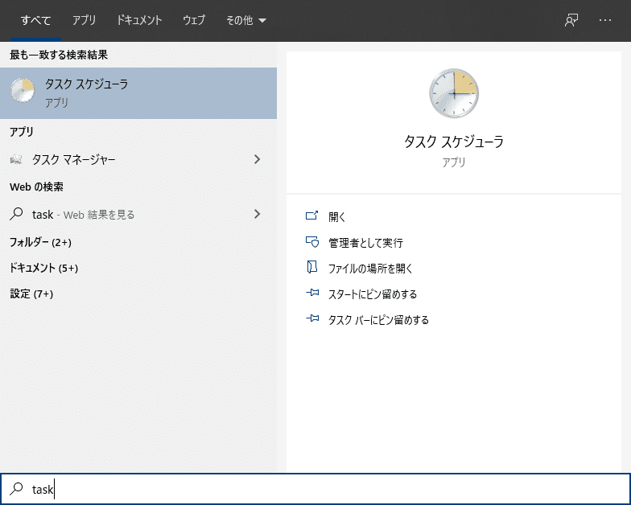
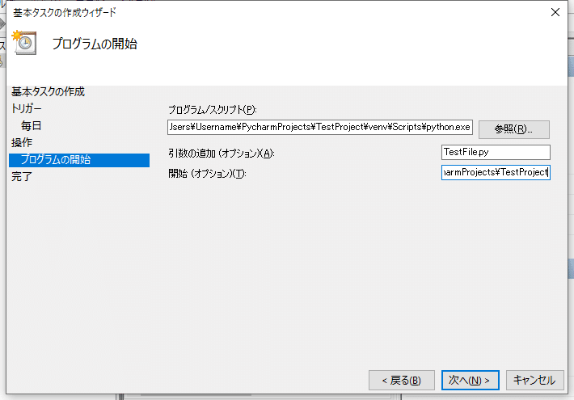

## まずはタスクスケジューラ起動

スタートボタン（コルテナ）を押して「task」と検索
タスクスケジューラが出るのでそれを起動

## 基本タスクの作成→名前→トリガー→操作→プログラム開始

PycharmのTestProjectのTestFile.pyを実行する場合
TestFile.pyのパス：`C:\Users\Username\PycharmProjects\TestProject\TestFile.py`

## プログラム/スクリプト

`C:\Users\Username\PycharmProjects\TestProject\venv\Scripts\python.exe`

## 引数の追加

TestFile.py

## 開始

`C:\Users\Username\PycharmProjects\TestProject`

## 終わり

タスクスケジューラで定期実行できるので便利だね！
