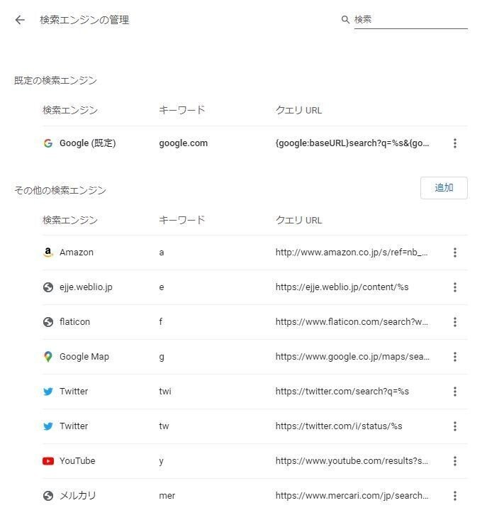

カスタムエンジン設定ファイルのパス
`C:\Users\USERNAME\AppData\Local\Google\Chrome\User Data\Default\Web Data`
これをコピーして新しいプロファイルのWebDataファイルを入れ替えるだけ
プロファイル開かれてるとファイルいじれないのでChrome閉じてからファイル入れ替えてChromeを再起動すれば問題なく更新される

Googleアカウントを複数使うためにプロファイルも複数同時に使い始めたけど、検索エンジンの設定移すの面倒すぎて後回しにしてたけど、こんなに簡単にできるならもっと早くやっとけばよかった。

参考：https://base64.work/so/google-chrome/3837083
