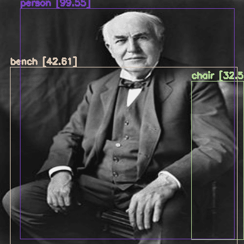

GoogleDriveはマウント済み

まずは1回だけ実行が必要なやつ

```bash
cd '/content/drive/MyDrive/Colab Notebooks/MyModules'
git clone https://github.com/AlexeyAB/darknet.git #url
cd 'darknet'
sed -i 's/OPENCV=0/OPENCV=1/' Makefile
sed -i 's/GPU=0/GPU=1/' Makefile
sed -i 's/CUDNN=0/CUDNN=1/' Makefile
sed -i 's/CUDNN_HALF=0/CUDNN_HALF=1/' Makefile
sed -i 's/LIBSO=0/LIBSO=1/' Makefile
make
wget https://pjreddie.com/media/files/yolov3.weights
```

Driveの中にdarknetとyolov3を入れてる
容量は全部で0.5Gくらいか（GoogleDriveの無料枠は15G）
Makefileの中身を変えてるのは、
GPU,CUDNNはGPUを使うため
LIBSOは、Pythonから扱うために必要なやつ
その他のOPENCVとCUDNN_HALFは必要なのか分からない。なくても動いた。

次にdarknetのフォルダの中に入ってるdarknet.pyをもとに作ったコード
こいつで画像URLから直接物体検出できる

```python
import os
os.chdir('/content/drive/MyDrive/Colab Notebooks/MyModules/darknet')

import darknet
import cv2
from google.colab.patches import cv2_imshow
import random
import numpy as np
import requests

def image_detection_by_url(src):
   random.seed(3)
   network, class_names, class_colors = darknet.load_network('cfg/yolov3.cfg','cfg/coco.data','yolov3.weights',batch_size=1)

   width = darknet.network_width(network)
   height = darknet.network_height(network)
   darknet_image = darknet.make_image(width, height, 3)

   image = cv2.imdecode(np.array(bytearray(requests.get(src).content), dtype=np.uint8), -1)
   image_rgb = cv2.cvtColor(image, cv2.COLOR_BGR2RGB)
   image_resized = cv2.resize(image_rgb, (width, height),
                           interpolation=cv2.INTER_LINEAR)

   darknet.copy_image_from_bytes(darknet_image, image_resized.tobytes())
   detections = darknet.detect_image(network, class_names, darknet_image, thresh=0.25)
   darknet.free_image(darknet_image)
   image = darknet.draw_boxes(detections, image_resized, class_colors)
   image = cv2.cvtColor(image, cv2.COLOR_BGR2RGB)
   return image, detections

src = "https://upload.wikimedia.org/wikipedia/commons/thumb/9/9d/Thomas_Edison2.jpg/250px-Thomas_Edison2.jpg"
image, detections = image_detection_by_url(src)

print(detections)
darknet.print_detections(detections)
cv2_imshow(image)
```

random.seed(3)
これで毎回画像に出てくる物体検出の四角い枠の色のランダムを固定する

image = cv2.imdecode(np.array(bytearray(requests.get(src).content), dtype=np.uint8), -1)
ここがURLから画像読み込むやつ

from google.colab.patches import cv2_imshow
ここはcolabだとcv2.imreadがエラーになるのでその回避


