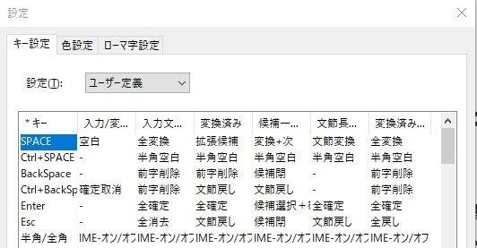

ユーザー辞書ではなく
ユーザー定義のキー設定の方

## 結論

ファイルはなくレジストリにあった
エクスポートでバックアップ可能

私のPCでは
`HKEY_CURRENT_USER\SOFTWARE\Microsoft\IME\15.0\IMEJP\StyleList\Custom`
この場所にあった

検索して唯一ヒットしたありがたい記事

[https://blog.goo.ne.jp/four_green_leaves/e/1012b6addc5efedb42ced1ea7042b82c](https://blog.goo.ne.jp/four_green_leaves/e/1012b6addc5efedb42ced1ea7042b82c)
