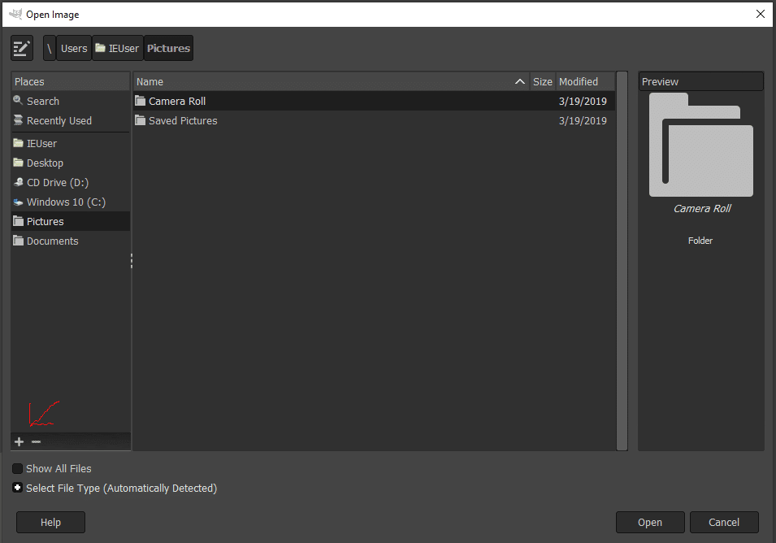

Windows標準のエクスプローラーのクイックアクセスを使う方法はないけど、GIMPのファイル選択ダイアログで特定フォルダをクイックアクセスみたいに追加が可能

特定フォルダ選択状態で左下のプラスボタンを押すだけ

## 参考URL

[https://gitlab.gnome.org/GNOME/gimp/-/issues/5280](https://gitlab.gnome.org/GNOME/gimp/-/issues/5280)
