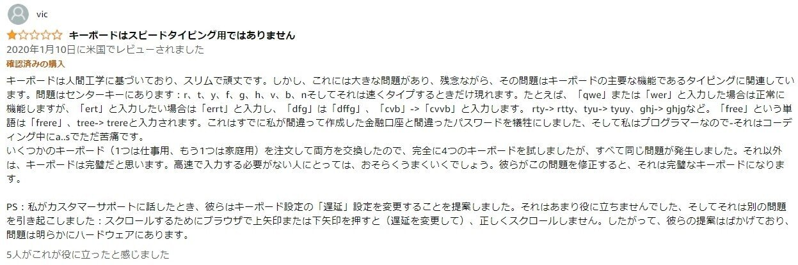
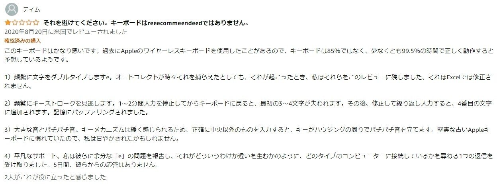

2021年8月頃に購入した無線2.4GHzテンキーレスコンパクトUS配列薄型キーボード6商品に対して
5商品が構造上の欠陥を持っており、使い物にならなかったので
欠陥商品について調べた結果とその見分け方をまとめる

## 2.4GコンパクトUSキーボードが少ない

どうしてもこの条件のキーボードが欲しいが圧倒的に商品数が少ない

理由は、
コンパクト＝持ち運び＝PCだけでなくスマホも対応＝bluetoothが有利
となってしまうからだ

無線キーボードに最も強いLogicoolでもコンパクトデザインのキーボードはUnifying(独自2.4G)のものはなくBluetooth対応のみである。

他のキーボードメーカーも似たような状況だが
唯一この絶滅危惧種を取り扱っているのが中華製の謎のメーカーたちだ

中華製の謎メーカーたちは、下記通販サイトに商品を並べてる

## 2.4GコンパクトUSキーボード取り扱いメーカーと通販サイト一覧

Amazon.co.jp
・Arteck
・iClever
・SHEYI
Amazon.com
・Arteck
・iClever
・Macally
・TECKNET
AliExpress.com
・Rapoo

楽天も取り扱ってるが、上記3サイトでより安く買える商品しかなかったので除外

さんざん上記3サイトをブラウジングしてきたがよく見かけるメーカーはこれら6メーカー
下記の通りだが、このうちのほとんどが欠陥モデルを販売している

## 欠陥モデルを取り扱ってるメーカー

・Arteck
・iClever
・Macally
・TECKNET

Amazon.comは全滅。

実際に勝って自分で使ってみて不具合が起き
メーカーに問い合わせたところ初期不良との回答をもらうが
交換しても同じ現象が発生するので構造上の欠陥と判断した

## 不具合の内容

上記4メーカーの取り扱う商品に共通して起こる不具合が
ダブルタイプ問題

１度しか押してないのに２度出力されてしまう
正確には押したタイミングと離すタイミングでそれぞれ１回ずつ出力されてしまうのだ

hura → hurua
tree → trere

などなど２つ以上のキーをほぼ同時押しするくらい高速タイピングをするとこの現象が起こる
ライトユーザーには、全く問題のないものだが
文章やプログラムコードを書く人には、使い物にならないレベル

※返品は即座に対応してくれた

## 不具合の報告

高速タイパーが少ないためか、商品レビューではなかなか報告されないが
唯一Amazon.comのレビューで同様のものを発見した。
下記日本語訳したレビュースクショ

## 複数商品で同じ不具合が起きる理由

不具合が起きる商品を見比べるとあることに気づいた

ところどころ部品が同じなのだ。
おそらく全く同じ工場で作られた部品を
各メーカーが購入して
独自で組み立ててメーカーのロゴとかをプリントしてから出荷してる
みたいなことだと思う
つまり最初に作った工場が問題なのかなって

## 問題がなかった商品

SHEYIのキーボード
傾斜が弱くてお気に入りではないが、不具合は起きなかった
[https://www.amazon.co.jp/gp/product/B093D9SMPX/](https://www.amazon.co.jp/gp/product/B093D9SMPX/)
これひとつだけ

## 到着待ち商品

AliExpressのRapooのやつ
Logicool.comのMX Keys Mini
