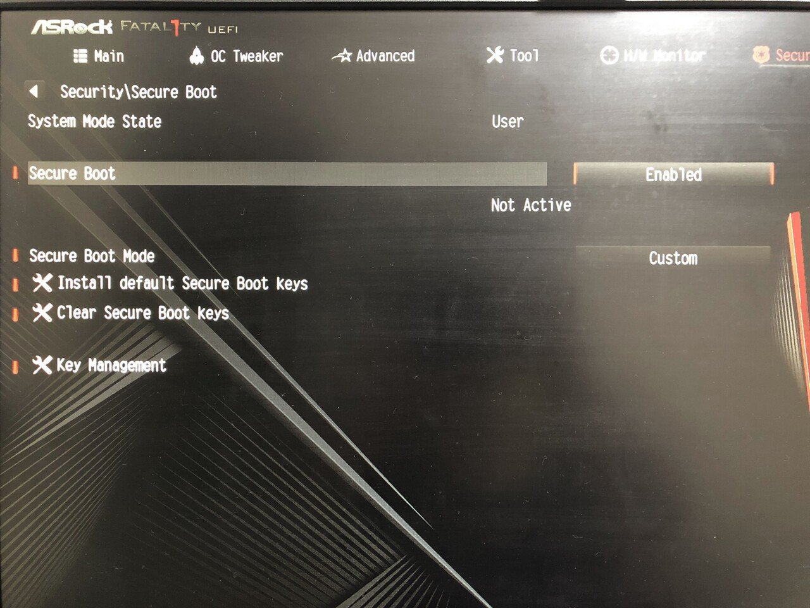

win11 アップデートに引っかかるセキュアブートのエラー処理方法

BIOS操作でセキュアブートを有効化しようとしたら

```text
secure boot can be enabled when system in user mode.
repeat operation after enrolling platform key.
```

とエラーが出てきた

調べても出てこなかったが、作るボタンすぐ下にあった。



Securityタブの`Secure Boot`ボタンのの二個下に
`Install Default Secure Boot Keys`ボタンがある
初めてKEYを作る人はここ押してね。とヒントが書いてあった。
そこを押したらKEYが作成されてsecure boot有効化できるようになった。
