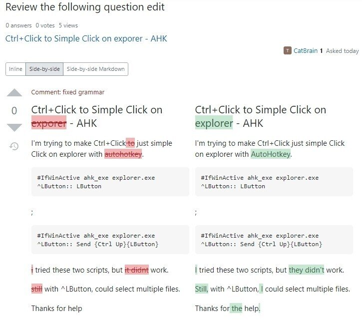

質問を投稿したら、勝手にミスタイプとか単語・文法を修正提案してくれてる！！

exporer → explorer

didnt → didn't

Thanks for help → Thanks for the help.

it → they

これすごすぎ！！

複数形とか意識する習慣ないから忘れがちだけど、それも修正してくれるので、非ネイティブが適当に文章書いてもOK!

と思ったけどよく見たら、ユーザー？が修正提案してくれるみたい
なので自動ではなかった
