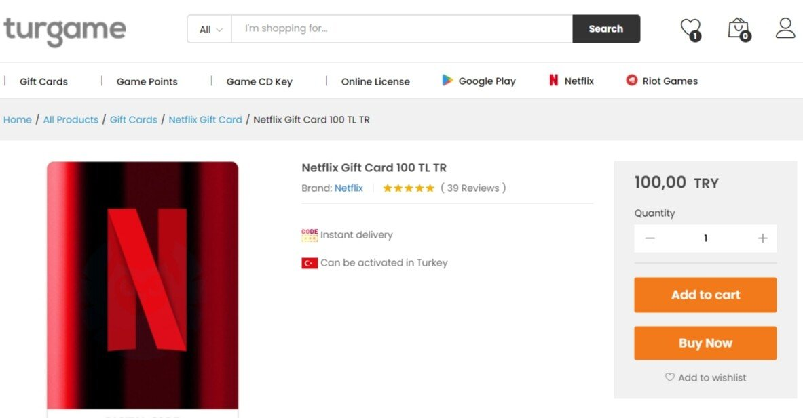
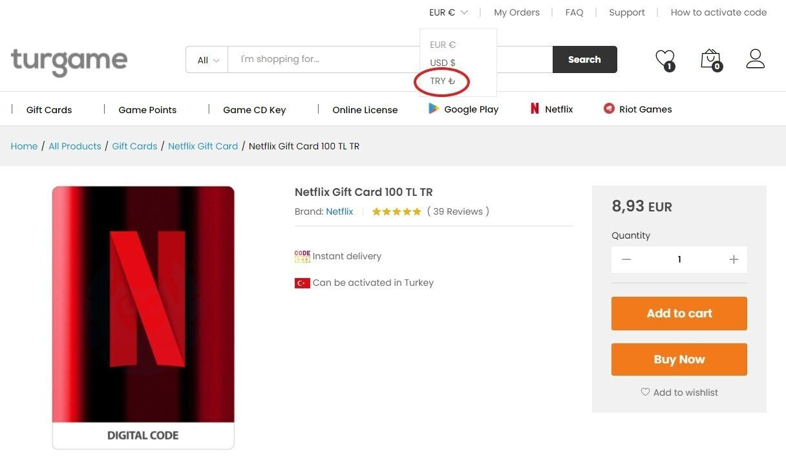
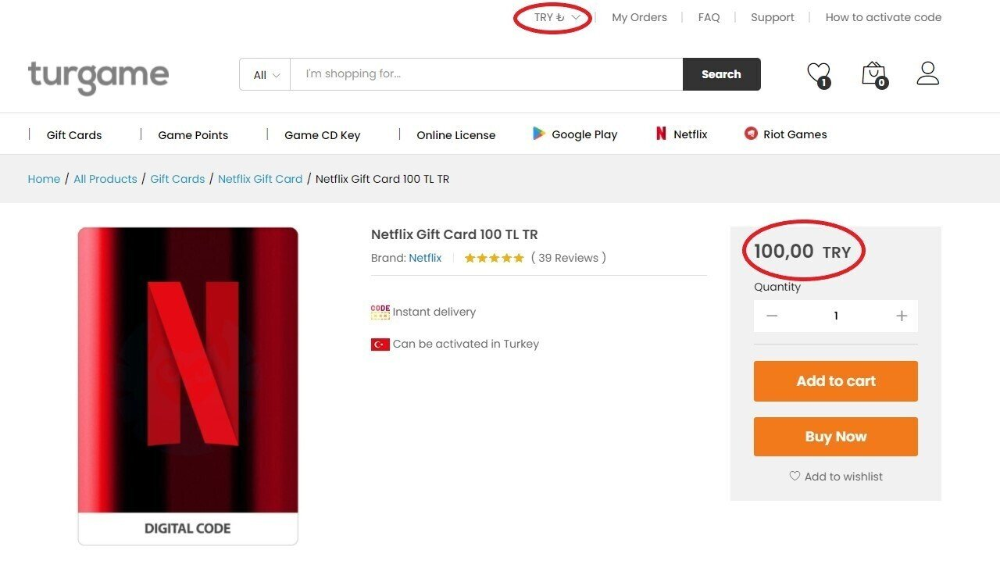
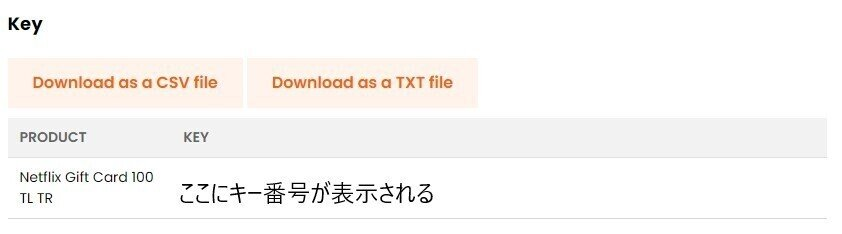
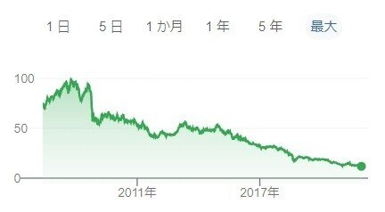

トルコNetflixのギフトカードを買えるサイトを調べるとやたらG2Aというサイトがヒットするけど、今回調べた中では最安値と比べて2割以上高かった
なんでみんな揃って高いサイト紹介してるんだろうと思ったら、アフィリエイト目的だった模様

## 100TLギフトカードの値段比較TOP5サイト

**1位：turgame.com
**商品100TL+利用料10TL+決済手数料2.26TL=112.26TL=**1,291円**
1TL=11.5円の計算
[https://www.turgame.com/netflix-gift-card-100-tl-tr/](https://www.turgame.com/netflix-gift-card-100-tl-tr/)

**2位：ByNoGame.com**
商品112TL+手数料2.8TL = 114.8TL =**1,320円**
1TL=11.5円の計算
[https://www.bynogame.com/tr/oyunlar/netflix/netflix/netflix-100-tl-hediye-kart](https://www.bynogame.com/tr/oyunlar/netflix/netflix/netflix-100-tl-hediye-kart)

**3位：GAMiVO.com**
商品1,459円＋手数料不明=**1,459円以上**[https://www.gamivo.com/product/netflix-gift-card-100-tl-tr](https://www.gamivo.com/product/netflix-gift-card-100-tl-tr)

**4位：G2A.com**
商品1,520円+手数料不明=**1,520円以上**
[https://www.g2a.com/netflix-gift-card-100-tl-turkey-i10000006307013](https://www.g2a.com/netflix-gift-card-100-tl-turkey-i10000006307013)

**5位：HRK.com**
商品14.32USD+手数料不明=**1,618円以上**
1USD=113円の計算
[https://www.hrkgame.com/en/games/product/netflix-gift-card-100-tl-tr](https://www.hrkgame.com/en/games/product/netflix-gift-card-100-tl-tr)

## 最安サイト：turgame.com

[https://www.turgame.com/netflix-gift-card-100-tl-tr/](https://www.turgame.com/netflix-gift-card-100-tl-tr/)

・トルコの専門サイトみたい
・instant delivery （購入した瞬間にオンラインで自動でコード送る）って書いてあったけど、届くまで20分くらいかかった
・レビュー見ると2時間かかった人とかもいたので、心構えが必要
[https://www.trustpilot.com/review/www.turgame.com](https://www.trustpilot.com/review/www.turgame.com)
・サポートチャットがすごい返信早かった
・Netflixのメアドとパスワードをサポートに教えれば、サポートの人がギフトカードのチャージを代行してくれる（もちろんその後パスワードは変更したほうがいいと思う。）

## 二番目に安いサイト：ByNoGame.com

[https://www.bynogame.com/tr/oyunlar/netflix/netflix/netflix-100-tl-hediye-kart](https://www.bynogame.com/tr/oyunlar/netflix/netflix/netflix-100-tl-hediye-kart)

・サイト内ポイントをクレカでチャージしてからそのポイントで商品購入の仕組み
・クレカの支払いからチャージが反映されるのに10分かかる
・チャージが反映された後も、審査時間が10分くらいあるため、すぐに購入できず、購入しようとするとエラーメッセージが出てきてビビる
↓FAQ
[https://www.bynogame.com/tr/yardim#yardim-finans-para-yatirma-genel-guvenlik](https://www.bynogame.com/tr/yardim#yardim-finans-para-yatirma-genel-guvenlik)
・チャージから購入するまで合計20分程度待たなきゃいけなかった

## おすすめはturgame.com

・turgameが一番安い
・turgameはサポートがアツい
・チャージがうまくできなかったら、turgameのサポートにメアドとパスワードを教えれば、チャージ代行してくれる。
・私は今回turgameとbynogameと両方利用したが次回以降turgameのみ利用するつもり

## turgame.comの購入方法

①アカウント登録 [https://www.turgame.com/my-account/](https://www.turgame.com/my-account/)
②商品ページを開く [https://www.turgame.com/netflix-gift-card-100-tl-tr/](https://www.turgame.com/netflix-gift-card-100-tl-tr/)
③通貨をEURからTRYに変更する（TRYにすると最安。あとで気づいた）
もしくはこのURL [https://www.turgame.com/netflix-gift-cards/?currency=TRY](https://www.turgame.com/netflix-gift-cards/?currency=TRY)

④Buy Now をクリック
⑤名前電話番号を入力
⑥支払方法は、GPAYを選択
⑦Place order
⑧その後GPAYの画面で決済手続きして終わり

**※海外サイトでの買い物が初めての場合の注意
**今まで国内でしかクレカを利用していなかったのに急に海外サイトでのクレカ利用があると、不正利用対策としてクレカがセキュリティロックされることがある
購入がうまくいかない場合、まずはカード会社に決済状況を確認
そこで解決しなかったらturgame.comのサポートに問い合わせ

**2022年9月11日追記**
今まで3度購入してきたが
2021年10月購入時はセキュリティロックがかかったがカード会社に連絡し、無事に買い物できた
2022年5月購入時はとてもスムーズでチェックアウト後2分でコードされた
2022年9月購入時は、またセキュリティロックがかかったがカード会社に連絡し無事に買い物できた
1度セキュリティロックを解除しても、そのサイトがホワイトリストとして保存されるわけではないので、また期間があくとセキュリティロックかかる可能性もあるみたい

## turgame.comのNetflixギフトコードの確認方法

①注文履歴画面を開く [https://www.turgame.com/my-account/orders/](https://www.turgame.com/my-account/orders/)
②対象注文のViewボタンを押す
③その画面にキーコードが表示される（すぐには表示されないので、おとなしく他のことやりながら待つ）

## turgame.comのサポート利用方法

[https://support.turgame.com/support/](https://support.turgame.com/support/)

ここからサポート内容のカテゴリを選択してチケットを発行
しばらくするとオペレーターがサポートチャットを開始してくれる
対応言語：英語、その他不明（日本語は非対応）

## Urban Free VPN

トルコNetFlixアカウント作成の際にVPNサービスというものを利用する必要があるが
一度だけしか使わないのに有料VPNサービスに登録するのもなんだか面倒だなあという人は、Chrome拡張機能の無料VPNがおすすめ
（turgameのサポートに頼ってVPN全く使わないのもありかも）

Chrome拡張機能の無料VPNの中でトルコサーバーにアクセスできるのは、ここだけだった

[https://chrome.google.com/webstore/detail/urban-free-vpn-proxy-unbl/eppiocemhmnlbhjplcgkofciiegomcon](https://chrome.google.com/webstore/detail/urban-free-vpn-proxy-unbl/eppiocemhmnlbhjplcgkofciiegomcon)

でも、無料のVPNはクレカ情報を抜き取られるという記事を見かけたので、VPNオンのときにクレカ入力とかはしない方がいいと思う
できればNetflixログインもVPNオフの状態で一度ログインしてから
VPNオンにしてページをリロードする方法が安心（多分）

## コードの入れ方

初回のみこのやり方
VPNオンでアカウント作成と同時にチャージ

[https://www.cg-method.com/life/netflix-costcut/#index_id5](https://www.cg-method.com/life/netflix-costcut/#index_id5)

そして２回目以降からは
VPNオフにしてから[netflix.com/redeem](https://netflix.com/redeem)にアクセスして進めてく

初回にVPNオンでチャージをすれば、もう既にトルコアカウントとして固定されてるので、その後はVPNなしで日本からでもチャージ可能

逆に、VPNオンにしてチャージしようとしたら、recaptchaに接続できませんのエラーが永遠に続いてチャージができなかった

また、どうしてもうまくいかない場合は、VPNなしでもアカウントだけ作れば、turgame.comのサポートにチャージ代行を依頼できる

## まとめてチャージしない方がおトクかも

「1トルコリラ いくら」で検索して出てきた表

これ見るとトルコの通貨であるトリコリラの価値が10年以上ずーーっと下がり続けてる
Netflix100TLギフトカードを買ってチャージしていくわけだけれど
もしかしたら今年買うより来年の方が安くなってるかもしれない
もちろん高くなる可能性もあるので何とも言えないけど

## メモ

記事内の価格の日本円換算は、公正なレートでの計算なので
実際にクレカで払うとVISAとかの独自レートで計算される上に外貨取扱の手数料もとられるので@+3%くらいになる
