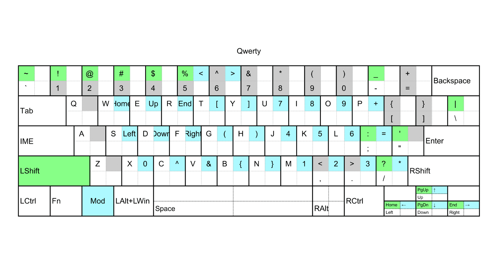
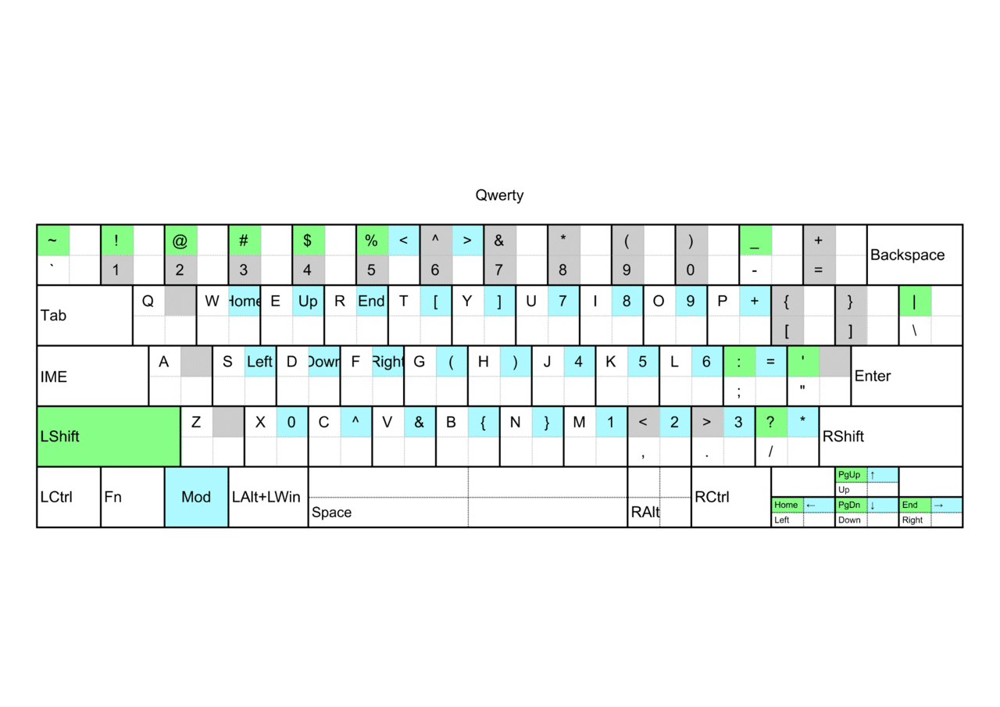
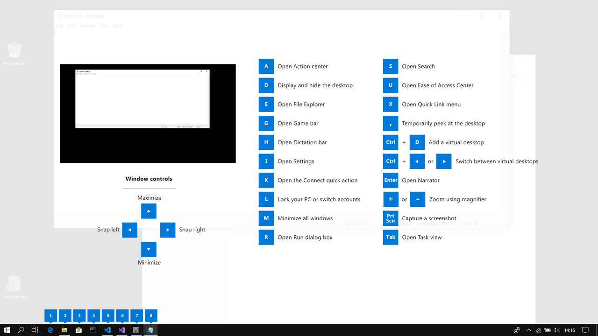

## 目的

記号キー押すのがつらいので
QWERTYに独自モディファイアキーを追加したい
モディファイアとは、CtrlとかShiftみたいに他のキーと同時押しさせるための同時押しショートカット専用キーのこと

## 配列画像



## 配列解説

Windowsキーを独自Modifierキーとした
本来のWindowsショートカットは自分が使うやつだけAltで設定
CapsLockは、全角半角キーにした
数字キーはIMEと関係なく半角数字がでるようにしてる

ShiftとModをそれぞれ押したときの出力キーを色をわけた
グレーは、使わない部分（使ってもいい）

## AutoHotkeyスクリプト

```ahk
#UseHook
SetNumLockState AlwaysOff
SetCapsLockState AlwaysOff
1:: Send {Numpad1}
2:: Send {Numpad2}
3:: Send {Numpad3}
4:: Send {Numpad4}
5:: Send {Numpad5}
6:: Send {Numpad6}
7:: Send {Numpad7}
8:: Send {Numpad8}
9:: Send {Numpad9}
0:: Send {Numpad0}
':: Send {"} ;"
+':: Send {'}
<+Up:: Send {PgUp}
<+Left:: Send {Home}
<+Down:: Send {PgDn}
<+Right:: Send {End}
LWin & `:: return
LWin & 1:: return
LWin & 2:: return
LWin & 3:: return
LWin & 4:: return
LWin & 5:: Send {<}
LWin & 6:: Send {>}
LWin & 7:: return
LWin & 8:: return
LWin & 9:: return
LWin & 0:: return
LWin & -:: return
LWin & =:: return
LWin & q:: return
LWin & w:: Send {Home}
LWin & e:: Send {Up}
LWin & r:: Send {End}
LWin & t:: Send {[}
LWin & y:: Send {]}
LWin & u:: Send {Numpad7}
LWin & i:: Send {Numpad8}
LWin & o:: Send {Numpad9}
LWin & p:: Send {+}
LWin & [:: return
LWin & ]:: return
LWin & a:: return
LWin & s:: Send {Left}
LWin & d:: Send {Down}
LWin & f:: Send {Right}
LWin & g:: Send {(}
LWin & h:: Send {)}
LWin & j:: Send {Numpad4}
LWin & k:: Send {Numpad5}
LWin & l:: Send {Numpad6}
LWin & `;:: Send {=}
LWin & ':: return
LWin & z:: return
LWin & x:: Send {Numpad0}
LWin & c:: Send {^}
LWin & v:: Send {&}
LWin & b:: Send {{}
LWin & n:: Send {}}
LWin & m:: Send {Numpad1}
LWin & ,:: Send {Numpad2}
LWin & .:: Send {Numpad3}
LWin & Up:: Send {↑}
LWin & Left:: Send {←}
LWin & Down:: Send {↓}
LWin & Right:: Send {→}
LWin:: return
+LWin:: return

!up:: Send #up
!down:: Send #down
!a:: Send #a
!d:: Send #d
!e:: Send #e
!i:: Send #i
!k:: Send #k
!r:: Send #r
!s:: Send #s

Capslock::Send {vkF3} ;全角半角
```

## 作った手順

Google Spread Sheetで配列を考え、画像作成
Google Apps Scriptでシートの値を参照し、AutoHotkeyのスクリプトを自動作成

## 注意

Win+Lキーだけはahkでスワップできないので、レジストリの変更が必要
変更したくない場合は、microsoft製のキースワップソフトであるpowertoysで変えるのがよさそう
ただスワップソフトを複数立ち上げると不具合出るとか出ないとか・・・。

## 感想

Winキーを小指は押しづらいけど、CapsLockはIMEに使っちゃってるし、左側に他の使えるキーがない
日本語配列だと無変換使ったりできるんだろうけど、US配列なので使えず
US配列だと右手側にモディファイア作成する配列も多々見たけど、
CtrlやShiftを左手小指でやってるのと同じ感覚でやりたいので左側がいいんだよなぁ・・・。

テンキーは0をRAltキーにしてたら使いにくくて
Xキーにあてたら、見た目は美しくないけど、とても使いやすかった

## おまけ：Winショートカット一覧

PowerToysのこれが一番見やすい


