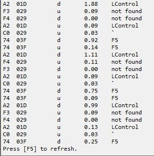

## 目的

Ctrl+Aはさほど使わないのに、1等地にあるので郊外に移動させ、場所の有効活用をしたい
手段として、Ctrl+チルダにCtrl+Aのホットキーを割り当てたい

## スクリプト

```ahk
^`::Send ^{a}
```

## 結果

Ctrl+チルダを押してもCtrl+Aは発火せず

## KeyHistoryを見てみた



これは、（Ctrl＋チルダ→F5）を3回繰り返したもの

①LCtrl Down
②not found key Up
③not found key Down
④LCtrl Up
⑤チルダ key Up

となっている

## 起こっていること

・Ctrl＋not found key up
・Ctrl+not found key down
・ただのチルダ key up

チルダは押されてもいないし、
Ctrlとのコンビネーションじゃなくてシンプルなキーアップだけが起こってる

そしてnot found key はそれぞれvirtual keyを見てみるとF3 F4となっているので二種類のnot found keyだということが分かる

vkf3 vkf4は、IMEトグルのときにあらわれるやつ

つまり、IMEONOFF だったり IMEOFFON が毎回されてるってこと

## 対策

Ctrl＋チルダのイベント発火は無理なので

Ctrl＋IMEのイベント発火をとらえる

## 対策スクリプト

```ahk
^vkF4::Send ^{a}
```

できた

## ちなみにAlt＋チルダの対策

```ahk
!vk19::msgbox alt+tilde
```

## 感想

・調べても全く情報が出てこなかったので多分US配列キーボードでIME使ってる人だけ起こるやつなのかな
