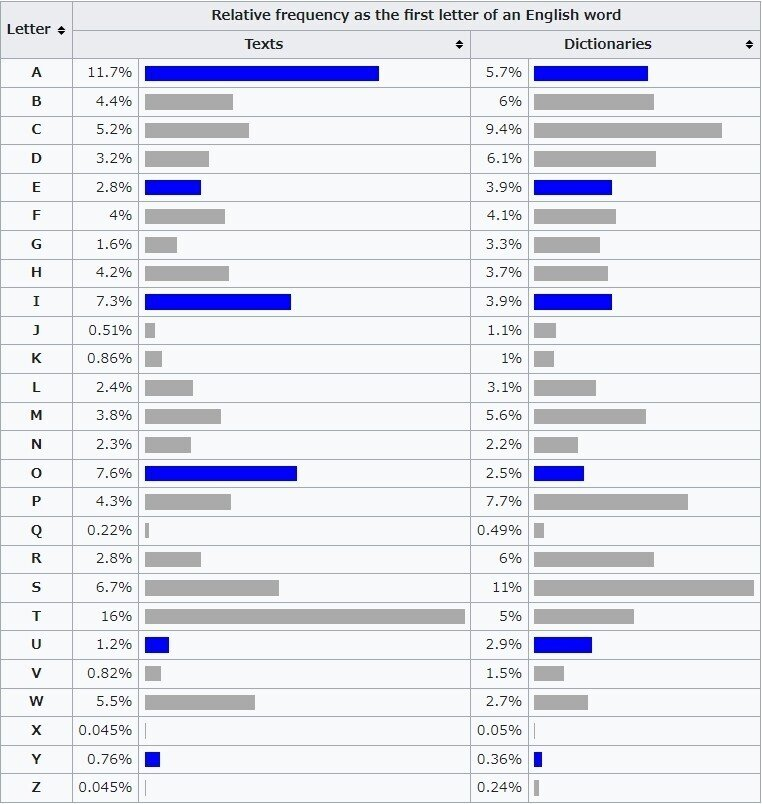

## 目的

配列を考えるため、キーボードでShiftを使う文字入力割合として頭文字の割合を調べた

[https://en.wikipedia.org/wiki/Letter_frequency](https://en.wikipedia.org/wiki/Letter_frequency)

## 頻出割合画像

## ランキング

多い順：A,O,I,E,U,Y
少ない順：X,Z,Q,J,K,V

## 考察

まずは、辞書と実生活でだいぶ違うんだなあ、と思った

英単語で多いのはSとかTだと思ってたけど
母音がTOP5に来るのは本当に驚いた
そんなに多いかなあ
それにYも日本人の感覚からすると母音みたいに扱ってるように見えるから
それも含めてやっぱり母音が上位なんだなって

少ない順は、まあだいたいそんな感じはしてたけど
Xから始まる英単語は中国人の名前くらいしか本当に思いつかない
以下思いつく低頻出英単語

z : zombie, zuckerburg
q : question, queen, quotation
j : joke, juice
k : kebab
v : visual, vanilla, vallentine, volcano

## Xから始まる単語

[https://www.morewords.com/most-common-starting-with/x](https://www.morewords.com/most-common-starting-with/x)

少し調べたらなじみがあると思ったのは
Xerox（頻出割合0.0005%)
X-ray（不明）

まあ、使わねーな

## Zから始まる単語

[https://www.morewords.com/most-common-starting-with/z](https://www.morewords.com/most-common-starting-with/z)

これZombie以外にも意外とあったぞ

Zero（0.0004%）
zip（0.0003%）
zone（0.0004%）
zebra（0.0005%）

## 感想

XとYの数値上は同じだけど
Xは生まれてこの方ほぼ使ったことないのに対して、
ZeroとZombieは数カ月に一度くらい使うだろう
