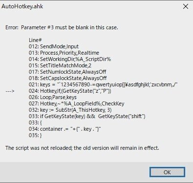

スクリプトでホットキーを作るときに使うHotkeyコマンド

ifをつける場合こうやって使う

```ahk
#If true
Hotkey, If, true
```

```ahk
#If GetKeyState("z")
Hotkey, If, (GetKeyState("z"))
```

一度#ifで使ってから再度Hotkeyコマンドで宣言するみたいなやり方
これをやってからHotkeyコマンドでキー割り当てを作る

しかし、どうやってもできないのがある

```ahk
#If GetKeyState("z","P")
Hotkey, If, (GetKeyState("z","P"))
```

ifの条件をgetkeystateのPオプションにしたとき
オプションのPをいれるためのGetKeyState内のコンマに反応してしまい

parameter #3 must be blank in this case
というエラーメッセージが出てしまう
それHotkeyコマンドの第三引数じゃないんだけどなあって感じ



ここに唯一この問題に触れてるトピックがあるが、解決に至っていない

[https://www.autohotkey.com/boards/viewtopic.php?t=35213](https://www.autohotkey.com/boards/viewtopic.php?t=35213)

## 回避法

Hotkeyコマンドは諦めて
#if getkeystate()を使って、スクリプトでファイルに自動書き起こしをするしかない
