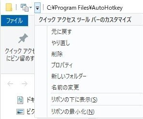

## 目的

ブラウザではCtrl＋Tで新規タブを開く
それと同じようにCtrl+Tで新規ファイルを作成したい

ついでに新規フォルダを作るCtrl+Shift＋Nも遠くて指がつりそうになるのでCtrl+Shift+Tで代用しておく

## スクリプト

```ahk title="Explorer.ahk"
#IfWinActive ahk_exe explorer.exe
	^t::Send !{1}{Up}{Up}{Enter}
	^+t::Send ^+{n}
```

## エクスプローラーの設定



クイックアクセスツールバーの一番目に新規ファイル作成ツールを置いてる
