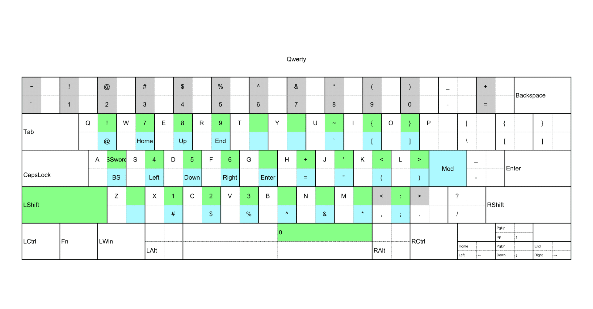
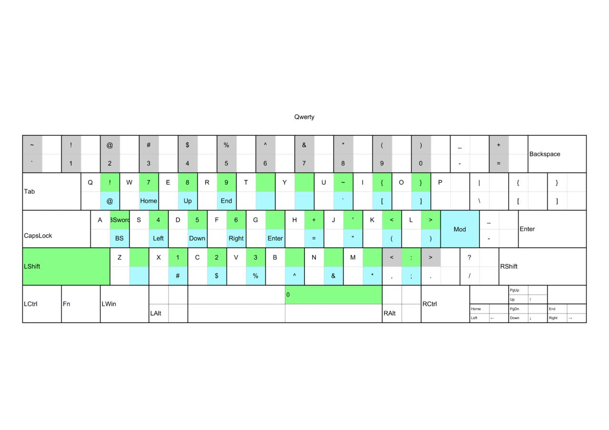

## 目的

ホームポジションから離さずにタイピングをすること

## 配列画像



## 配列解説

セミコロンキーをモディファイアに設定した
Modと同時押しで青色
ModとShiftと同時押しで緑色

## ahkスクリプト

```ahk
#UseHook
1:: Send {Numpad1}
2:: Send {Numpad2}
3:: Send {Numpad3}
4:: Send {Numpad4}
5:: Send {Numpad5}
6:: Send {Numpad6}
7:: Send {Numpad7}
8:: Send {Numpad8}
9:: Send {Numpad9}
0:: Send {Numpad0}
[:: Send {\}
]:: Send {[}
\:: Send {]}
`;:: return
':: Send {-}
+[:: Send {|}
+]:: Send {{}
+\:: Send {}}
+`;:: return
+':: Send {_}
+Up:: Send {PgUp}
+Left:: Send {Home}
+Down:: Send {PgDn}
+Right:: Send {End}
`; & `:: return
`; & 1:: return
`; & 2:: return
`; & 3:: return
`; & 4:: return
`; & 5:: return
`; & 6:: return
`; & 7:: return
`; & 8:: return
`; & 9:: return
`; & 0:: return
`; & -:: return
`; & =:: return
`; & q:: Send {@}
`; & w:: Send {Home}
`; & e:: Send {Blind}{Up}
`; & r:: Send {End}
`; & t:: return
`; & y:: return
`; & u:: Send {``}
`; & i:: Send {[}
`; & o:: Send {]}
`; & p:: return
`; & [:: return
`; & ]:: return
`; & \:: return
`; & a:: Send {BS}
`; & s:: Send {Blind}{Left}
`; & d:: Send {Blind}{Down}
`; & f:: Send {Blind}{Right}
`; & g:: Send {Enter}
`; & h:: Send {=}
`; & j:: Send {"}
`; & k:: Send {(}
`; & l:: Send {)}
`; & `;:: return
`; & ':: return
`; & z:: return
`; & x:: Send {#}
`; & c:: Send {$}
`; & v:: Send {`%}
`; & b:: Send {^}
`; & n:: Send {&}
`; & m:: Send {*}
`; & ,:: Send {`;}
`; & .:: return
`; & Up:: Send {↑}
`; & Left:: Send {←}
`; & Down:: Send {↓}
`; & Right:: Send {→}
`; & z Up:: Send {RShift Up}
#If GetKeyState("LShift")
`; & `:: return
`; & 1:: return
`; & 2:: return
`; & 3:: return
`; & 4:: return
`; & 5:: return
`; & 6:: return
`; & 7:: return
`; & 8:: return
`; & 9:: return
`; & 0:: return
`; & -:: return
`; & =:: return
`; & q:: Send {!}
`; & w:: Send {Numpad7}
`; & e:: Send {Numpad8}
`; & r:: Send {Numpad9}
`; & t:: return
`; & y:: return
`; & u:: Send {~}
`; & i:: Send {{}
`; & o:: Send {}}
`; & p:: return
`; & [:: return
`; & ]:: return
`; & \:: return
`; & a:: Send +^{Left}{BS}
`; & s:: Send {Numpad4}
`; & d:: Send {Numpad5}
`; & f:: Send {Numpad6}
`; & g:: return
`; & h:: Send {+}
`; & j:: Send {'}
`; & k:: Send {<}
`; & l:: Send {>}
`; & `;:: return
`; & ':: return
`; & z:: return
`; & x:: Send {Numpad1}
`; & c:: Send {Numpad2}
`; & v:: Send {Numpad3}
`; & b:: return
`; & n:: return
`; & m:: return
`; & ,:: Send {:}
`; & .:: return
`; & Up:: return
`; & Left:: return
`; & Down:: return
`; & Right:: return
`; & Space::Send {Numpad0}
#If
```

## 感想

左テンキーがとてもいい
テンキーはたぶん格子状の方が打ちやすいと思うけど
こういう斜めに並んでる場合、左右対称じゃないので
左右で打ちやすさが変わるけど、左手側のアクセスの方がキーがまとまってるので一番遠いキーも打ちやすくなる
やればわかる​
