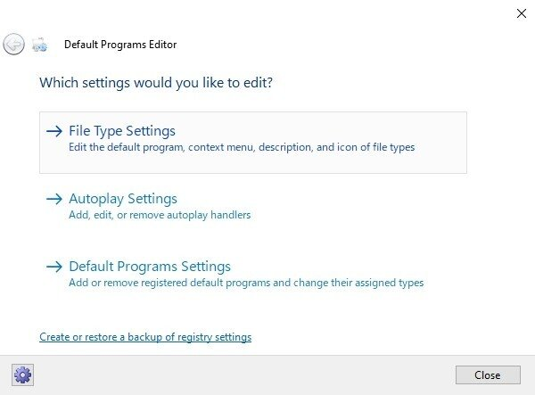
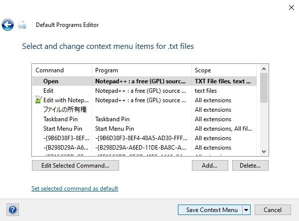
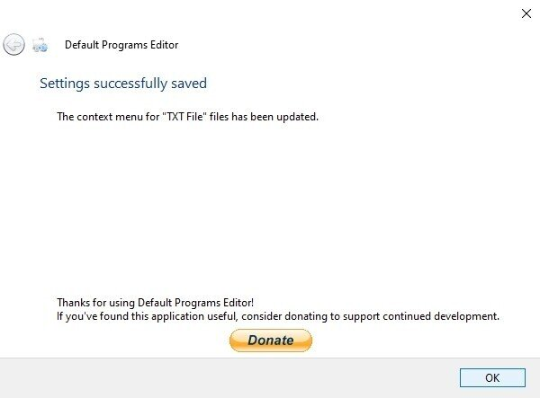

## 目的

テキストファイルをメモ帳ではなく、他のエディタで開くときに、右クリック＋Eで一発で開きたい

複数拡張子の設定を変更したいので、レジストリエディタは使わずフリーソフトでポチポチ簡単に変更したい

## 使用ソフト

Default Program Editor
拡張子ごとの右クリックのコンテキストメニューを簡単に変えられる
拡張子ごとのファイルのアイコンも変えられる

## 編集ボタンのデフォルトソフト変更のやり方

[https://forest.watch.impress.co.jp/library/software/defprogedit/](https://forest.watch.impress.co.jp/library/software/defprogedit/)

ここからダウンロードして解凍して
Default Programs Editor.exeを開く

File Type Settingをクリック

Context Menuをクリック

こういう画面になるのでここから任意の拡張子を探す

.txt拡張子を選択して、右下のNextをクリック

Editという列をダブルクリック

Program Pathのところがメモ帳へのパスになっているので

任意のソフトのEXEパスを入力してNextクリック

Save Context Menuをクリック

OKをクリック

終わり

便利すぎ

## 感想

終わってから気づいたけど

テキストファイルのエディタをすべてかえるなら

編集ボタンの中身をいじるよりも
編集ボタンを消してから
`コンピューター\HKEY_CLASSES_ROOT\*\shell`
ここに共通のボタン作った方がのちのち管理が楽だ
