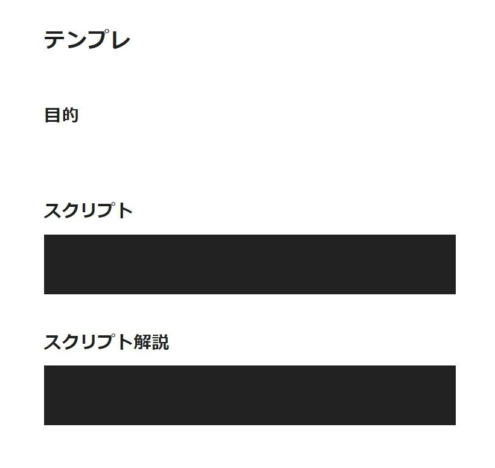
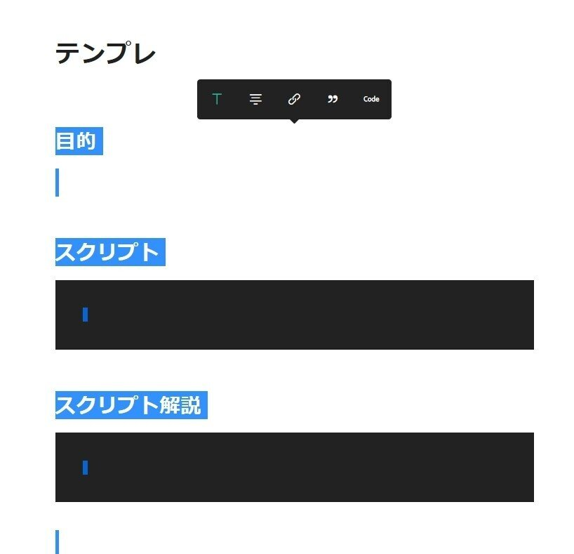

## 目的

毎回同じテンプレートで書くのでその準備を自動化したい

## 準備

テンプレの型を作る



本文を全選択してコピー



## 準備スクリプト

```ahk
!Delete::FileAppend,%Clipboardall%,D:\Downloads\test.txt
```

このスクリプトを作って
Alt+Deleteで先ほどコピーで作ったクリップボードの中身を書式形式なども含めてテキストファイルに保存

## スクリプト

```ahk
	!F1::
		Send ^2
		Old_ClipBoard := ClipBoardAll
		FileRead , ClipBoard, *c D:\Downloads\test.txt
		ClipWait
		Send ^v
		ClipBoard := Old_ClipBoard
		return
```

Escでクリップボードの中身を書式形式なども含めて任意のファイルに保存

## スクリプト解説

```ahk
Send ^2
```

最初のこれは、なぜかコピペでは一行目が見出しにならなかったので、noteの標準ショートカットで見出し行にしてる

```ahk
		Old_ClipBoard := ClipBoardAll
```

現在のクリップボードをいったん避難

```ahk
        FileRead , ClipBoard, *c D:\Downloads\test.txt
		ClipWait
		Send ^v
		ClipBoard := Old_ClipBoard
```

最初に作ったテキストファイルを読み込み
clipwaitで反映を待ち
Ctrl+Vで貼りつけて
最後に、避難してたクリップボード内容を戻して終わり

## 感想

これ！すげー便利！

最初は、javascriptのdocumentfragmentで作ろうとしたけど、要素の属性値の規則性が分からなかったのでコピペという荒業を使った
コピペ素材として使うようなこういうファイルっていつもどこに置けばいいか分からないのでファイルが必要なスクリプトは苦手だ
