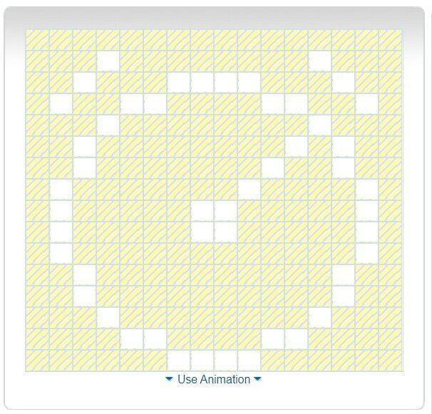
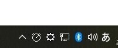

## 目的

タスクトレイ用のアイコンが欲しい

検索するとPNG画像から16px画像へのの変換サイトばかり出てくるが、必要なのは自分で16x16を描画するサイト
使いやすい順にまとめておく

## サイト比較

**1位：fabicon.cc**
[https://www.favicon.cc/](https://www.favicon.cc/)
クリックで描画、右クリックで消しゴム
というシンプルで直感的な操作
**こだわりのない人はこれを選んでおけばOK**

**2位：faviconer.com**
[http://www.faviconer.com/](http://www.faviconer.com/)
ペンや消しゴムなど5つのツールのショートカットがある
**長く作業する人はこっちの方がストレスなくていいかも**

**3位：X-icon editor**
[https://www.xiconeditor.com/](https://www.xiconeditor.com/)
なんだかツールはたくさんあるけど、
マス目の描画がひどい
とても使おうとは思わない

**4位：Favicon Icon Drawing Program Online Free
**[https://www.somacon.com/p44.php](https://www.somacon.com/p44.php)
ちっちゃい！！
描画エリアがちっちゃすぎて目がおかしくなる！
Ctrl押しながらドラッグで描画
Alt押しながらドラッグで消しゴム
という謎のシステム
古いサイトなのかなという印象
使おうとは思わない

## デザイン参考サイト

[https://www.flaticon.com/](https://www.flaticon.com/)

これにつきる

ここで適当なワードで検索してからカラーをブラックにしぼれば、シンプルなデザインがヒットするので、それを参考する

## 作ってみた

参考にした画像

作ったやつ

タスクトレイの見え方

## あとがき

16マスしかないから、技術なしでも描けるので楽しい
