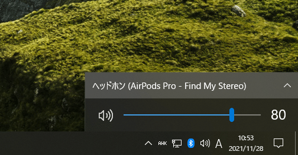
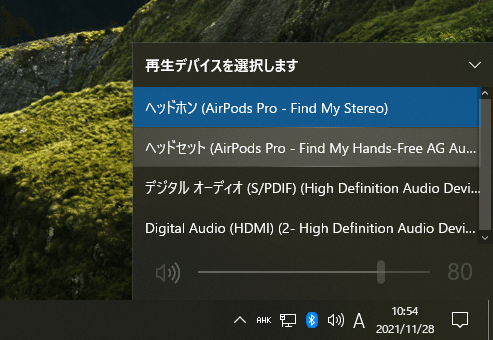
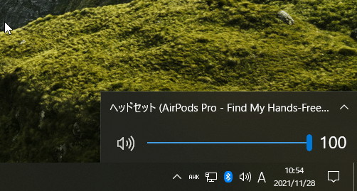

## 困っていること

ZOOMやDiscordで通話を開始すると
Chromeで再生してるYoutubeの音が聞こえなくなる

## 原因

AirPods Proを使っていること

## 原因解説

AirPods Proは、2つのモードがある
Stereoモード：高音質。音を聞くことはできるがマイクは使えない
Hands-Freeモード：低音質。聞くこともマイクで話すこともできる

普段Youtubeを再生しているときはStereoモードで聞いているのに、
通話を始めるとマイクをオンにする必要があるのでHands-Freeモードで通話が始まる。
しかし、Youtubeの音声出力は引き続きStereoモードが選択されているため、Hands-FreeモードとなっているAirPods Proには音声が届かないという仕組み

## 解決方法

Youtubeの音声出力先をHands-Freeモードに変更する

## 解決方法詳細

右下のサウンドアイコンをクリック

デバイス名の書かれている行をクリック

Stereoが選択されているので
Hands-Freeをクリック選択

Hands-Freeが選択された

## 結果

通話を続けながらYoutubeを聞けるようになったが
低音質のため、音がガビガビになる
音声入力のみHands-Free、出力はStereoというふうにできればいいのだがそれはできないようなので
音ガビガビ問題についての解決方法は、マイクを別で用意するしかないみたい

## 参考

[https://support.discord.com/hc/en-us/community/posts/360058634351-Discord-mutes-all-other-sounds](https://support.discord.com/hc/en-us/community/posts/360058634351-Discord-mutes-all-other-sounds)

[https://www.reddit.com/r/Zoom/comments/isz3rq/computer_audio_not_working_while_in_zoom_call_can/](https://www.reddit.com/r/Zoom/comments/isz3rq/computer_audio_not_working_while_in_zoom_call_can/)

## あとがき

こんな2つのモードがあるなんて知らなかった！
