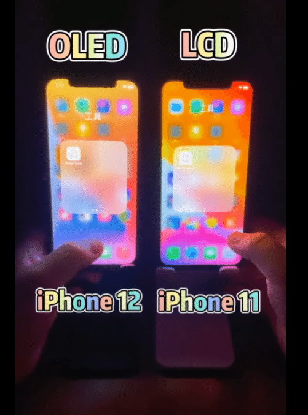

## 目的

LCD：液晶ディスプレイ
OLED：有機EL
・有機ELは黒ピクセルを発色しないので黒ピクセルが多い時の発色がきれい
・映像がなめらか
とのことなので、それを体験したい

## 黒ピクセルが多いときの発色の美しさが分かる

[https://www.youtube.com/watch?v=ADWDgTvxemo](https://www.youtube.com/watch?v=ADWDgTvxemo)

黒ピクセルが多いときには、確かに有機LEDが本当に美しい

だけど、普段スマホで動画も見なければ、ダークモードもそんなに使ってないので、黒ピクセルが少ないときの発色の違いも見ておきたい

## 通常利用時の発色の違い

[https://www.youtube.com/watch?v=CWC5isgNhls](https://www.youtube.com/watch?v=CWC5isgNhls)

さほど変わんねえ
OLEDがほんの少しだけきれいに見える気もするけど
撮影方法の問題かもわからない程度

## 結論

動画見たり、メッセージアプリでダークモード使ってるなら、OLEDのメリットは大きいが、黒ベース画面を多用しないなら発色は素人目では同じだし、消費電力もほぼ同じなので、安価なLCD機種でも全然OK

分かりやすい比較動画をあげてくれた方々に感謝
