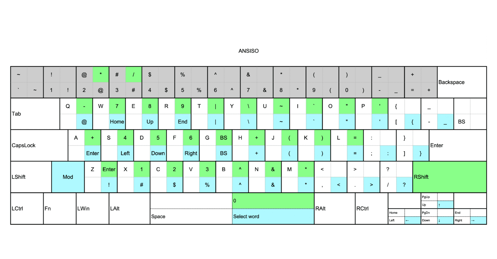
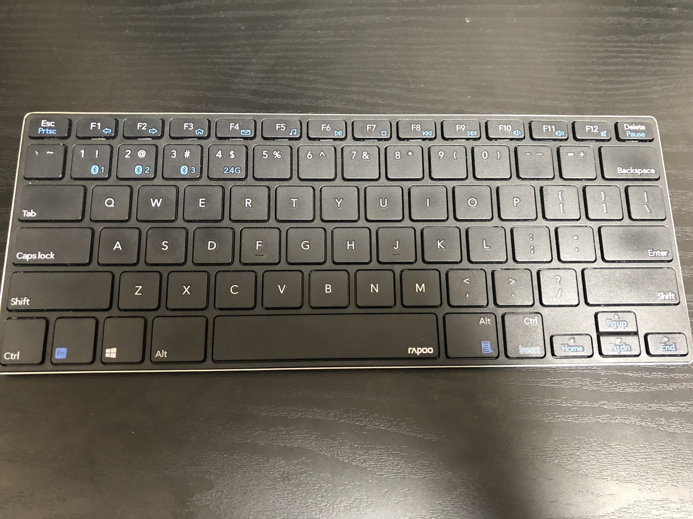
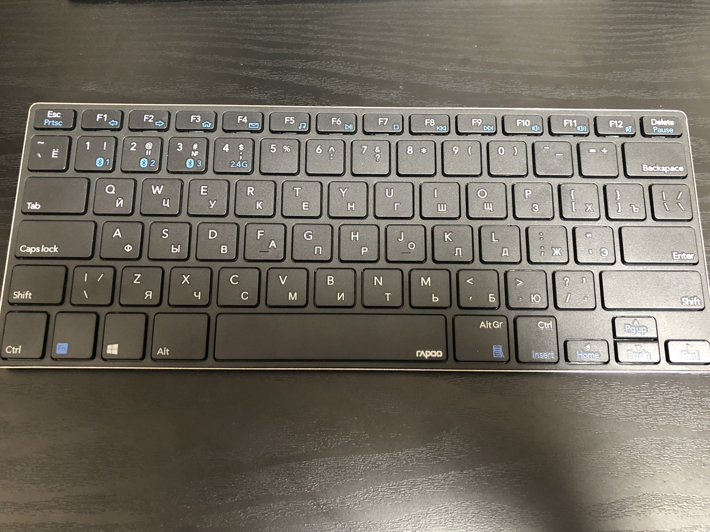
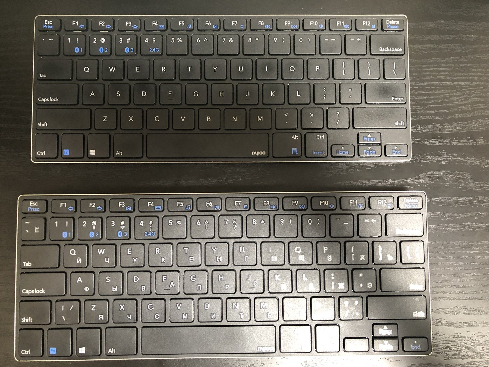
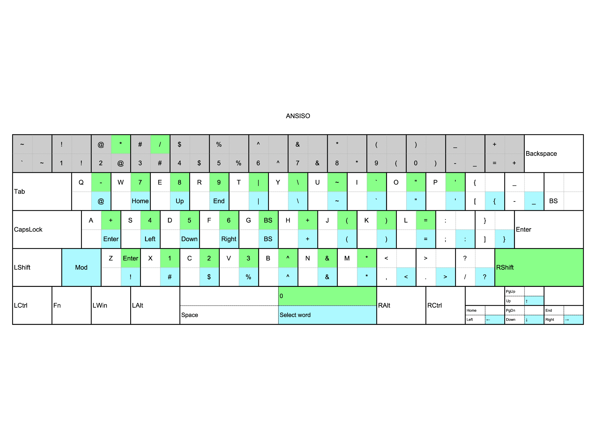

ANSIとISOのハイブリッド配列を見つけてしまった名付けて**ANSIO配列
**言葉で説明するより見てもらった方がはやいか

## ANSI



## ANSIO



## 比較



ANSISOの奇妙なところは、バックスラッシュが2つあること
押すと2つともバックスラッシュを出力するがvirtualkeyは異なるので、それぞれ違う割り当てをすることが可能だった

## 配列詳細



バックスラッシュと同時押しで水色のやつを出力
右シフトと同時押しで緑色のやつを出力という仕組み

同時押しの設定に加えて各括弧とハイフンとクォーテーションらへんもスワップしてる

## AutoHotkeyスクリプト

```ahk
#UseHook
1:: Send {Numpad1}
2:: Send {Numpad2}
3:: Send {Numpad3}
4:: Send {Numpad4}
5:: Send {Numpad5}
6:: Send {Numpad6}
7:: Send {Numpad7}
8:: Send {Numpad8}
9:: Send {Numpad9}
0:: Send {Numpad0}
]:: Send {-}
vkdc:: Send {BS}
':: Send {]}
+]:: Send {_}
+vkdc:: Send {}
+':: Send {}}
<+Up:: Send {PgUp}
<+Left:: Send {Home}
<+Down:: Send {PgDn}
<+Right:: Send {End}
vke2 & `:: Send {~}
vke2 & 1:: Send {!}
vke2 & 2:: Send {@}
vke2 & 3:: Send {#}
vke2 & 4:: Send {$}
vke2 & 5:: Send {`%}
vke2 & 6:: Send {^}
vke2 & 7:: Send {&}
vke2 & 8:: Send {*}
vke2 & 9:: Send {(}
vke2 & 0:: Send {)}
vke2 & -:: Send {_}
vke2 & =:: Send {+}
vke2 & q:: Send {@}
vke2 & w:: Send {Home}
vke2 & e:: Send {Up}
vke2 & r:: Send {End}
vke2 & t:: Send {|}
vke2 & y:: Send {\}
vke2 & u:: Send {~}
vke2 & i:: Send {``}
vke2 & o:: Send {"} ;"
vke2 & p:: Send {'}
vke2 & [:: Send {{}
vke2 & ]:: Send {_}
vke2 & a:: Send {Enter}
vke2 & s:: Send {Left}
vke2 & d:: Send {Down}
vke2 & f:: Send {Right}
vke2 & g:: Send {BS}
vke2 & h:: Send {+}
vke2 & j:: Send {(}
vke2 & k:: Send {)}
vke2 & l:: Send {=}
vke2 & `;:: Send {:}
vke2 & ':: Send {}}
vke2 & z:: Send {!}
vke2 & x:: Send {#}
vke2 & c:: Send {$}
vke2 & v:: Send {`%}
vke2 & b:: Send {^}
vke2 & n:: Send {&}
vke2 & m:: Send {*}
vke2 & ,:: Send {<}
vke2 & .:: Send {>}
vke2 & Up:: Send {↑}
vke2 & Left:: Send {←}
vke2 & Down:: Send {↓}
vke2 & Right:: Send {→}
vke2 & Space:: Send {Select word}
RShift & 2:: Send {*}
RShift & 3:: Send {/}
RShift & q:: Send {-}
RShift & w:: Send {Numpad7}
RShift & e:: Send {Numpad8}
RShift & r:: Send {Numpad9}
RShift & t:: Send {|}
RShift & y:: Send {\}
RShift & u:: Send {~}
RShift & i:: Send {``}
RShift & o:: Send {"} ;"
RShift & p:: Send {'}
RShift & a:: Send {+}
RShift & s:: Send {Numpad4}
RShift & d:: Send {Numpad5}
RShift & f:: Send {Numpad6}
RShift & g:: Send {BS}
RShift & h:: Send {+}
RShift & j:: Send {(}
RShift & k:: Send {)}
RShift & l:: Send {=}
RShift & z:: Send {Enter}
RShift & x:: Send {Numpad1}
RShift & c:: Send {Numpad2}
RShift & v:: Send {Numpad3}
RShift & b:: Send {^}
RShift & n:: Send {&}
RShift & m:: Send {*}
RShift & Space:: Send {Numpad0}
```

vkdc と vke2は、バックスラッシュのそれぞれのvirtualcode

## あとがき

独自モディファイア追加配列はいくつかやってみたけど
今のところISOのバックスラッシュをモディファイアにするのが一番しっくりきてる
そして、ANSISOだと、ANSIよりも1ボタン多いので、完全上位互換な気がしてる
