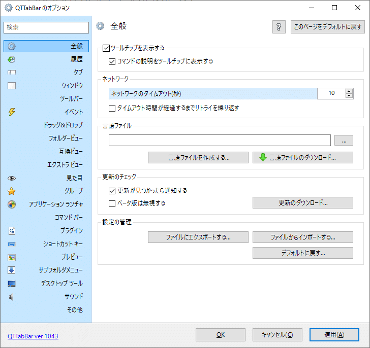
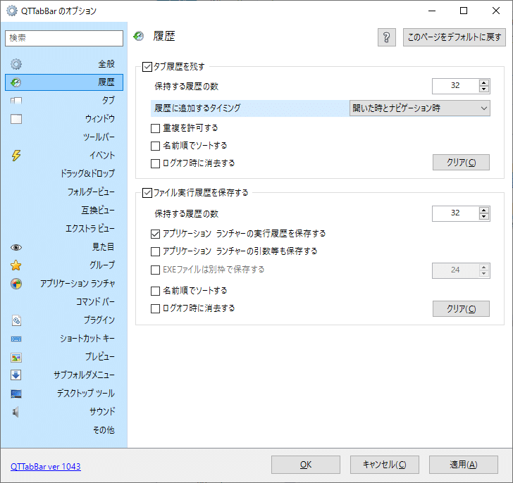
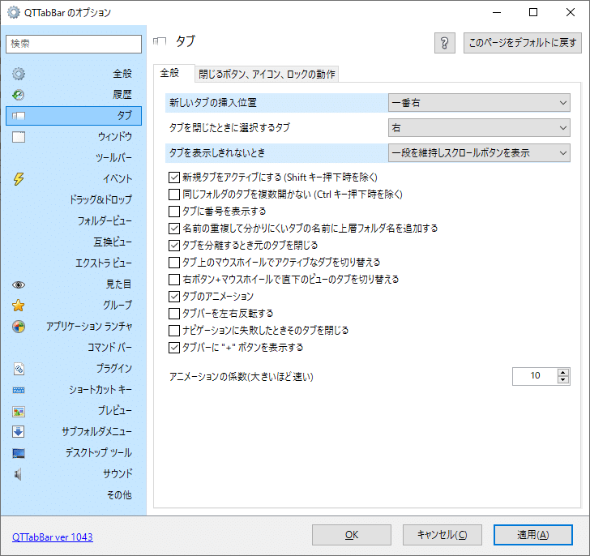
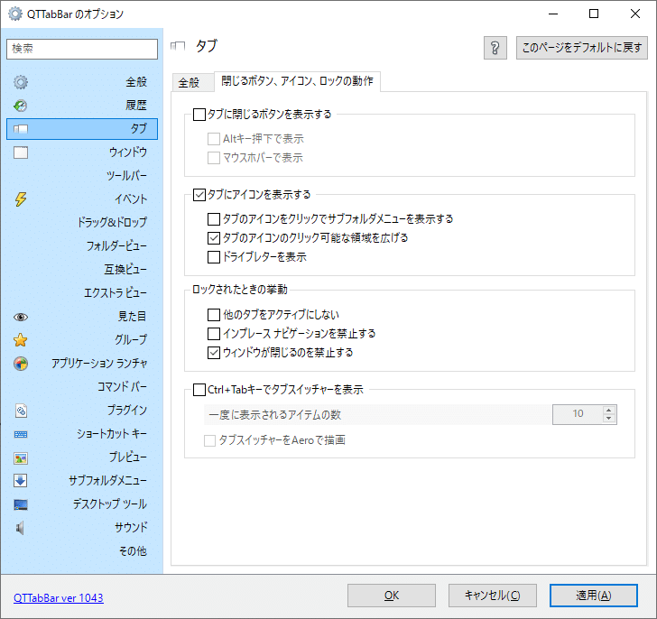
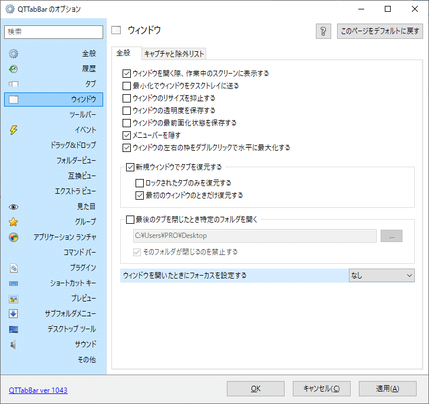
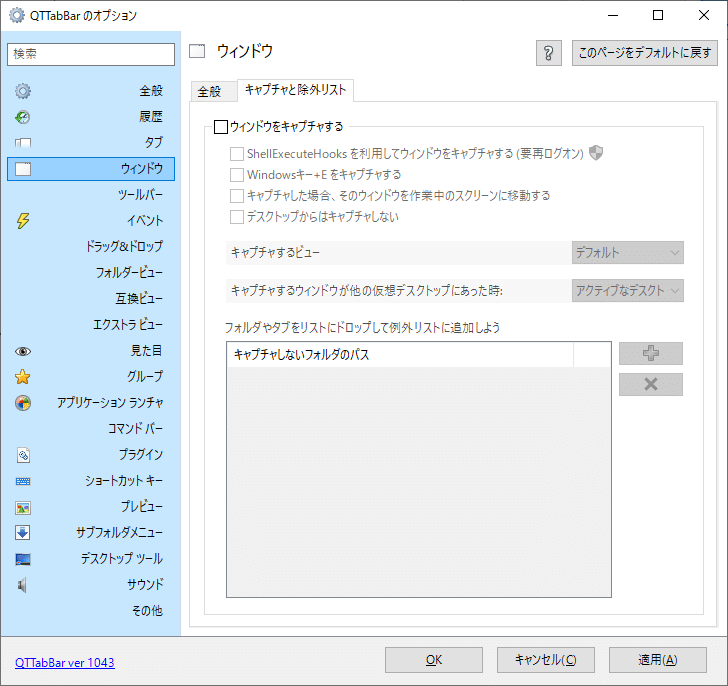
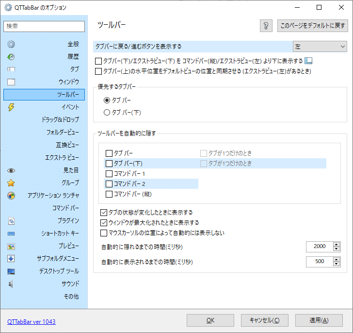
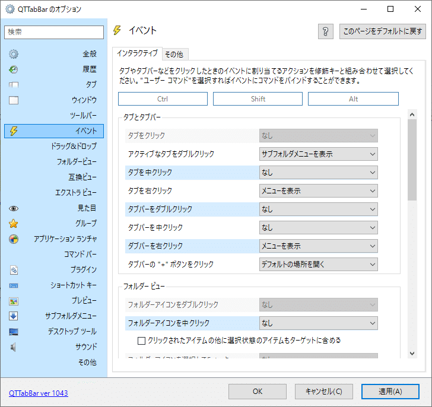
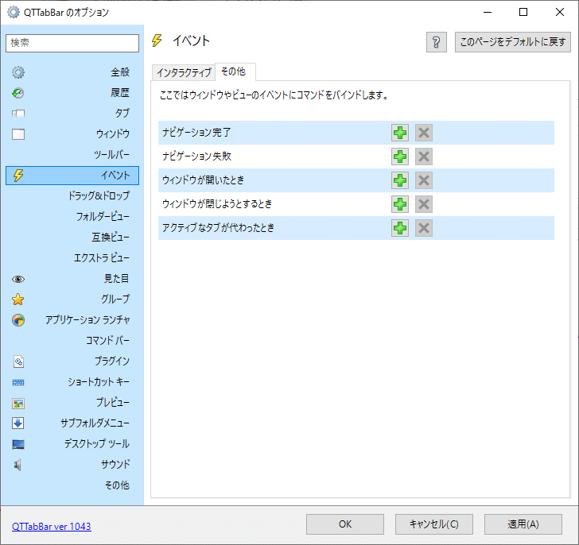
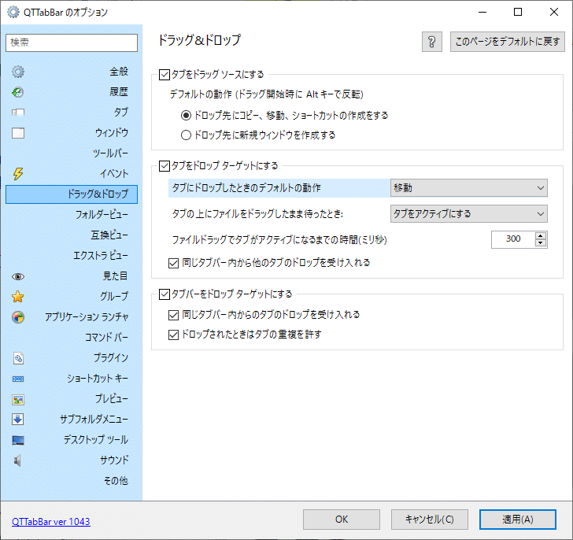

## 目的

設定がかなり細かいけど
意図した通りに動かない項目もあるので
再度見直したいときのためにメモ

## 全般タブ

ほぼデフォルトでも問題なさそうだけど更新通知だけチェック入れた

**「ツールチップを表示する」**
「コマンドの説明をツールチップに表示する」にチェック
慣れるまではチェック入れたままにしておくと、各ボタンにマウスホバーでヒントテキストが出る

「ネットワーク」
エクスプローラーにもネットワークって項目あるけど同じやつかな
多分、家でパソコン1台しか使ってない人には縁がない項目だと思う

「言語ファイル」
最初から日本語だったので不要
もし英語にしたいとかあったら、英語の言語ファイルをどっからか持ってきて、ここで適用させられるのかな

**「更新のチェック」**
「更新が見つかったら通知する」にチェック
さほど更新頻度高くないと思うけど、ストレスに感じたらその時に外そう

「設定の管理」
設定ファイルのインポートエクスポートができる

## 履歴

ここはデフォルトのまま変更なし

特にいじるところはないけど、

**「重複を許可する」**
入れてもいいかもしれない悩みどころ

「ファイル実行履歴」
まだ使う予定ないけど、とりあえず設定そのまま

## タブ（全般）

ここはいくつか変えたと思う

ここはChromeと同じ使用感になるように変えた

**「同じフォルダのタブを複数開かない」**
合理的に思いきや、重複してることに気づかないで操作してるもんだから
突然開くなると一瞬ビックリしてしまうのでオフ

**「マウスホイールでタブ切り替え」**
普通にいらない
Ctrl+Tabで変えよう

**「タブを分離」「ナビゲーション」**
この2つの言葉についてはよく分からない

## タブ（閉じるボタン、アイコン、ロックの動作）

**「閉じるボタンを表示する」**
アイテムをドラッグしてタブの上にドロップするときに誤作動で閉じるボタンクリックが発生するのでオフ
Chromeと同じようにCtrl+Wで閉じよう

## ウィンドウ（全般）

**「ウィンドウを開く際、作業中のスクリーンに表示する」**
この項目は分からない

「リサイズ抑制」
ウィンドウのサイズを変更することができなくなる

**「新規ウィンドウでタブを復元する」**
これ必須
再起動しても自動で前回と同じ作業環境を用意できる

**「最初のウィンドウのときだけ復元する」
**コンパネもQTTabBarの影響でタブ化されているが
コンパネを開いたときにエクスプローラーが持っているタブを引き継いでしまうので
これをオンにしとくとコンパネで引き継がなくなる

しかし、エクスプローラーの2つ目以降の新規ウィンドウも1つ目のウィンドウのタブを引き継いでしまってる
ここはバグなのか？
まあタブマンなのでマルチウィンドウな使い方する予定はないから特に困りはしないけど

## ウィンドウ（キャプチャと除外リフト）

**「ウィンドウをキャプチャする」
**これがオンだとコンパネを開いたときにエクスプローラーが閉じてしまう謎現象が起きるので
オフにしておくとコンパネ開いてもノーストレスになる

## ツールバー

これは、デスクトップの一番下のタスクバーを右クリック→ツールバー→QTTabデスクトップツールにチェックをいれると
タスクバーになんか表示されるやつの設定
特に使う予定もないので設定はいじってないはず

## イベント（インタラクティブ）

右クリックでメニュー開ければあとはショートカット見えるのでだいたいそれで対応
その他は、Chromeと同じように
Ctrl＋Clickで新規タブで開く
Shift+Clickで新規ウィンドウで開く
にしてる
Altは全てなし

## イベント（その他）

これはたぶん、この5つのイベントをトリガーにしてスクリプトか何か自動実行させられるやつと思うけど、まだ手をつけてないのでよくわからない

## ドラッグ＆ドロップ

通常だとファイルやフォルダがドラッグドロップできるけど
それに加えてタブもできるようにしたりする設定

「タブをドラッグソースにする」
タブを引っ張って動かせるようにするやつ

「タブをドロップターゲットにする」
引っ張ったタブやファイルなどをタブの上にドロップできるようにする

**「タブにドロップしたときの動作」**
これはシステム規定だと、
同じドライブ内は移動
違いドライブ同士だとコピー
の仕様だと思うけど
これを移動に設定すればCとDドライブを行き来するのも楽になる
地味に便利

「タブバーをドロップターゲットにする」
タブの右の空白のところに引っ張ってきたアイテムをドロップできるようにする

## フォルダービュー

「BSキーで1階層上へ移動」
これは通常だとBSで戻るの機能だけどそれを使ってるからオフにしておく

「カーソルループ」
これは分からない

「マウスのX1/X2ボタン」
というのは、進む戻るが割り当てられてるサイドボタンのこと

## 参考

## あとがき
