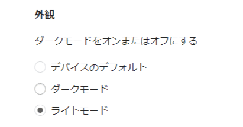
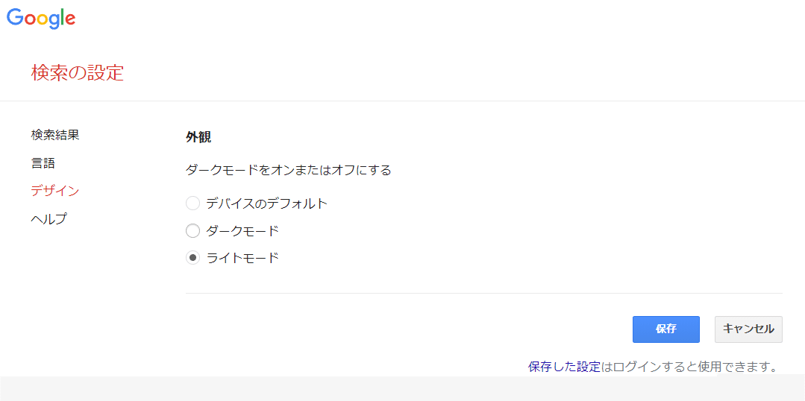

## 目的

エクスプローラーはダークモードにしたいけど
Chromeの検索結果はライトモードにしたい

## やり方

[https://www.google.com/preferences?hl=ja&fg=1#appearance](https://www.google.com/preferences?hl=ja&fg=1#appearance)

上のURLを踏んで
設定をライトモードに変更して保存

## 参考

[https://mypigchan.com/google-black](https://mypigchan.com/google-black)

唯一検索結果のダークモード解除のやり方を書かれていたサイト
大感謝

## あとがき

ずっとエクスプローラーをダークモードにしたかったけど
chromeの検索結果が見にくすぎて何度も断念してたけど
ようやくやり方見つけられて超快適になった
