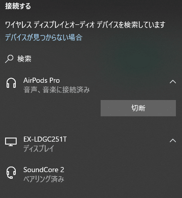

## 目的

AirPods Proをキーボードショートカットで一発で接続したい

## スクリプト

```ahk
!a::GoSub ConnectToBluetooth
ConnectToBluetooth:
	WinActivate, ahk_class Shell_TrayWnd
	WinWaitActive, ahk_class Shell_TrayWnd
	Send #k
	Sleep 1500
	IfWinActive, 接続する
		Send {Tab}{Down}{Enter}
	else
		msgbox failed
	return
```

## スクリプト解説

```ahk
!a::GoSub ConnectToBluetooth
```

Alt＋AでConnectToBluetoothラベルを実行

```ahk
ConnectToBluetooth:
	WinActivate, ahk_class Shell_TrayWnd
	WinWaitActive, ahk_class Shell_TrayWnd
	Send #k
```

安定性向上のためにタスクバーにフォーカスを当ててから
Win+Kでデバイスの接続画面を開く



こんなやつ

```ahk
	Sleep 1500
```

ロード待ちに1.5秒待つ

```ahk
	IfWinActive, 接続する
		Send {Tab}{Down}{Enter}
	else
		msgbox failed
	return
```

デバイス接続画面がアクティブなら
キーボード操作で一番上のデバイスの接続する

アクティブでないならfailedメッセージを出す

## 問題点

目的のデバイスが一番上に並んでないといけないうえに
Win+Kがうまく発動しないことがあるので非常に不安定

## 超便利！APIありのやり方

```ahk
!a::CnctBthDvc("AirPods Pro")

CnctBthDvc(deviceName){
	DllCall("LoadLibrary", "str", "Bthprops.cpl", "ptr")
	toggle := toggleOn := 1
	VarSetCapacity(BLUETOOTH_DEVICE_SEARCH_PARAMS, 24+A_PtrSize*2, 0)
	NumPut(24+A_PtrSize*2, BLUETOOTH_DEVICE_SEARCH_PARAMS, 0, "uint")
	NumPut(1, BLUETOOTH_DEVICE_SEARCH_PARAMS, 4, "uint")   ; fReturnAuthenticated
	VarSetCapacity(BLUETOOTH_DEVICE_INFO, 560, 0)
	NumPut(560, BLUETOOTH_DEVICE_INFO, 0, "uint")
	loop {
		If(A_Index = 1){
			foundedDevice := DllCall("Bthprops.cpl\BluetoothFindFirstDevice", "ptr", &BLUETOOTH_DEVICE_SEARCH_PARAMS, "ptr", &BLUETOOTH_DEVICE_INFO)
			if !foundedDevice{
				msgbox no bluetooth devices
				return
			}
		}else{
			if !DllCall("Bthprops.cpl\BluetoothFindNextDevice", "ptr", foundedDevice, "ptr", &BLUETOOTH_DEVICE_INFO){
				msgbox no found
				break
			}
		}
		if (StrGet(&BLUETOOTH_DEVICE_INFO+64) = deviceName){
			VarSetCapacity(Handsfree, 16)
			DllCall("ole32\CLSIDFromString", "wstr", "{0000111e-0000-1000-8000-00805f9b34fb}", "ptr", &Handsfree)   ; https://www.bluetooth.com/specifications/assigned-numbers/service-discovery/
			VarSetCapacity(AudioSink, 16)
			DllCall("ole32\CLSIDFromString", "wstr", "{0000110b-0000-1000-8000-00805f9b34fb}", "ptr", &AudioSink)
			loop{
				hr := DllCall("Bthprops.cpl\BluetoothSetServiceState", "ptr", 0, "ptr", &BLUETOOTH_DEVICE_INFO, "ptr", &Handsfree, "int", toggle)   ; voice
				if (hr = 0){
					if (toggle = toggleOn)
						break
					toggle := !toggle
				}
				if (hr = 87)
					toggle := !toggle
			}
			loop{
				hr := DllCall("Bthprops.cpl\BluetoothSetServiceState", "ptr", 0, "ptr", &BLUETOOTH_DEVICE_INFO, "ptr", &AudioSink, "int", toggle)   ; music
				if (hr = 0){
					if (toggle = toggleOn)
						break 2
					toggle := !toggle
				}
				if (hr = 87)
					toggle := !toggle
			}
		}
	}
	DllCall("Bthprops.cpl\BluetoothFindDeviceClose", "ptr", foundedDevice)
	; msgbox done
	return
}
```

コピペなので解説不可

AirPods Proのところを任意のデバイス名に変更すれば使える

## 参考

[https://www.autohotkey.com/boards/viewtopic.php?style=17&t=83224](https://www.autohotkey.com/boards/viewtopic.php?style=17&t=83224)

## あとがき

APIありのやつすっごい便利
