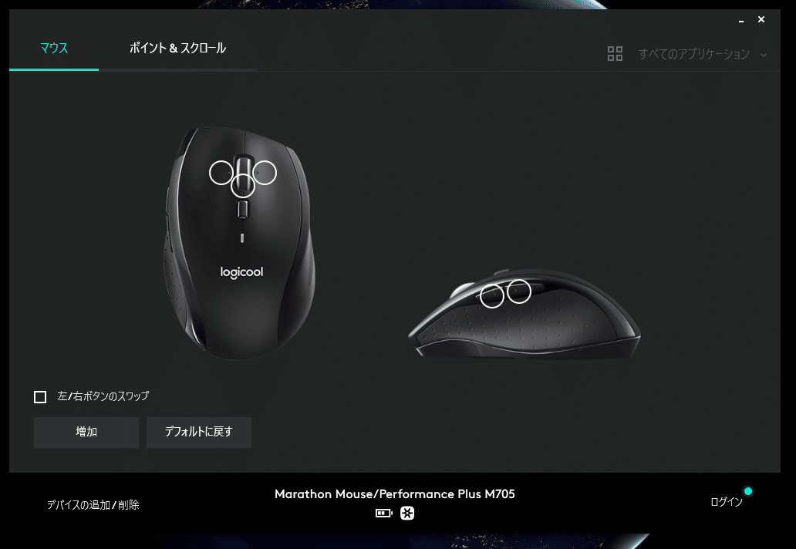

ahkのマウスキー
XButton1：サイドボタン手前
XButton2：サイドボタン奥
WheelLeft：スクロールホイールを右にずらす
WheelRight：スクロールホイールを左にずらす

## 症状

これらが効かない
KeyHistoryでもフックしていない

## 対策

ロジクールのソフトが先にフックされて他のキーに置き換えられていたのが原因だったので
デフォルトに戻すボタンを押すとなおった
