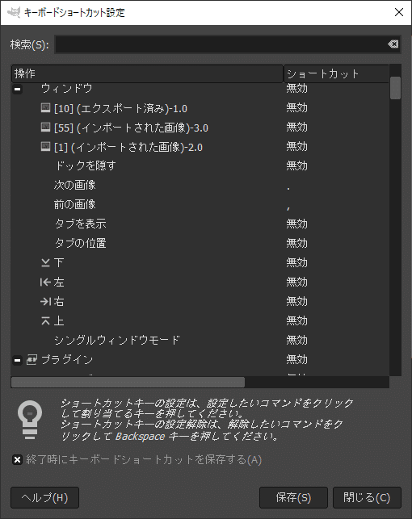

## 目的

GIMPの画像タブ切り替えをCtrlTabでできるようにして、馴染みやすくさせる

## GIMPの設定



GIMPのキーバインド設定では、直接CtrlTabを使えないので適当なキーを設定しておく
今回は、仮でカンマとドットに設定してみた

## AHKスクリプト

```ahk
#If WinActive(" – GIMP")
	^Tab::Send {.}
	^+Tab::Send {,}
```

## あとがき

ソフトの設定じゃどうしようもないときにこうやってAHKでキーハックできるのホントに便利
