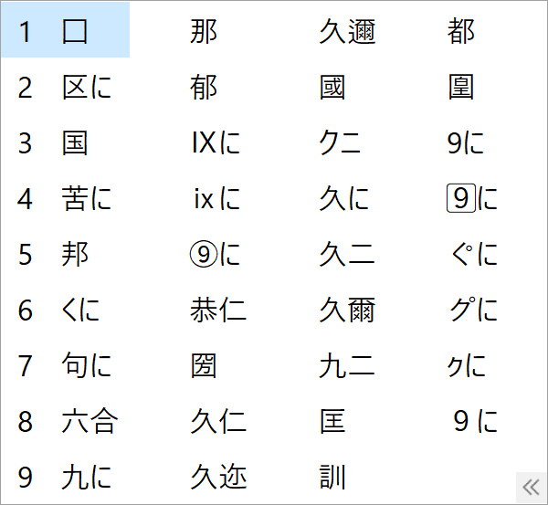
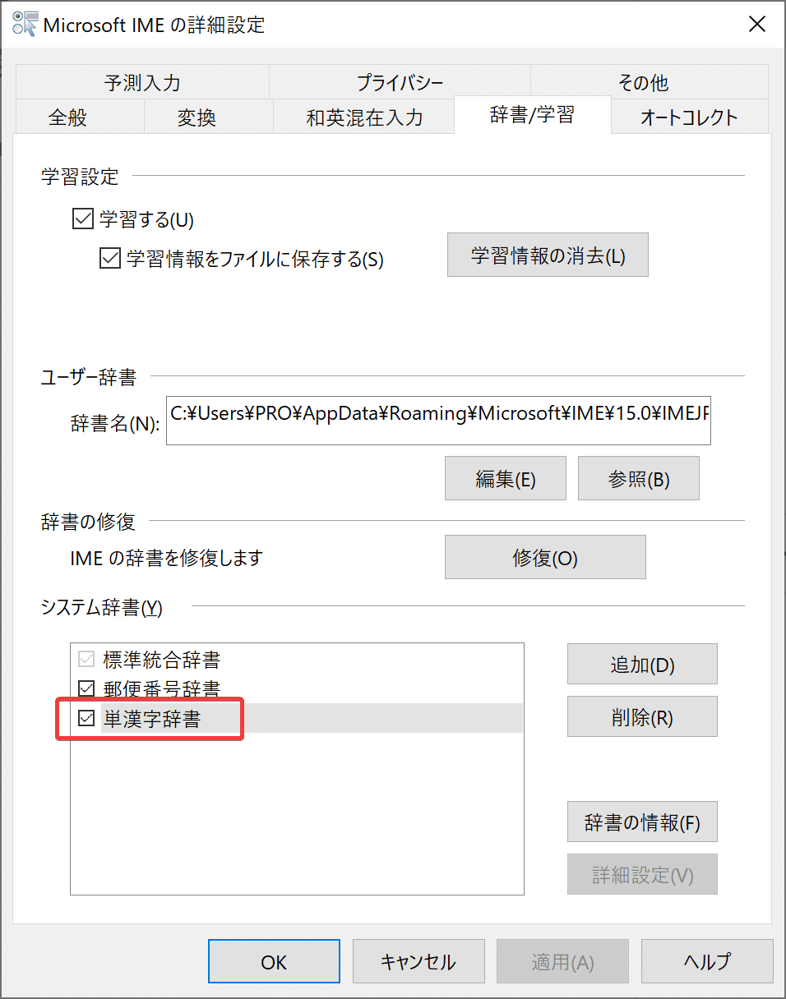

## 方法

名前順で一番後ろになるような文字をファイル名の先頭につける

## 何の文字が最適か

[https://rcmdnk.com/blog/2020/08/02/computer-google/](https://rcmdnk.com/blog/2020/08/02/computer-google/)

この記事によると1つの答えがあった

> 囗(イ、コク, SJIS: 0x9A98, UTF-16: 0x56D7、口(クチ)じゃない)がスペース的な感じで良さげかな

`囗会議事録.txt`みたいなイメージ
見た目も記号みたいで使い勝手も悪くない

## `囗`をどうやって出すか

`くに`と入力して変換で出てくる

## なぜか、たまに変換に出てこない対策

IMEのプロパティ→詳細設定→辞書/学習タブ→システム辞書→単漢字辞書にチェックで「くに」の変換で毎回出てくるようになった

