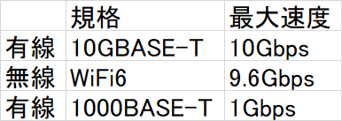

## 目的

5G対応の楽天モバイルSIMを据え置きSIMルーターに挿して、家で固定回線化して使う計画にあたって
・LANポート付きのホームルーターを買うか
・Wi-Fi 6対応でLANポートなしのモバイルルータ―を買うか
適切な判断をするため

\*Wi-Fi 6（IEEE 802.11ax）

## 調べた結果

日本語では下記2つが少し参考になったがいまいち断言しておらず、信頼性に欠ける

[https://internet.watch.impress.co.jp/docs/column/wifi_qanda/1326941.html#:~:text=%E3%82%A4%E3%83%B3%E3%82%BF%E3%83%BC%E3%83%8D%E3%83%83%E3%83%88%E3%81%B8%E3%81%AE%E3%82%A2%E3%82%AF%E3%82%BB%E3%82%B9%E3%81%8C%E4%B8%BB%E3%81%AA%E7%94%A8%E9%80%94%E3%81%A7%E3%81%82%E3%82%8C%E3%81%B0%E3%80%81Wi%2DFi%E3%81%8C%E3%83%9C%E3%83%88%E3%83%AB%E3%83%8D%E3%83%83%E3%82%AF%E3%81%AB%E3%81%AA%E3%82%8B%E3%81%93%E3%81%A8%E3%81%AF%E5%B0%91%E3%81%AA%E3%81%84%E3%81%AF%E3%81%9A%E3%81%A7%E3%81%99%E3%80%82Wi%2DFi%206%E3%82%845%E3%81%AE%E7%92%B0%E5%A2%83%E3%81%8C%E3%81%99%E3%81%A7%E3%81%AB%E6%95%B4%E5%82%99%E3%81%95%E3%82%8C%E3%81%A6%E3%81%84%E3%82%8B%E3%81%AA%E3%82%89%E3%80%81Wi%2DFi%E3%81%A8%E6%9C%89%E7%B7%9ALAN%E3%81%AE%E4%B8%A1%E6%96%B9%E3%81%AB%E5%AF%BE%E5%BF%9C%E3%81%97%E3%81%A6%E3%81%84%E3%82%8BPC%E3%81%A7%E3%81%82%E3%81%A3%E3%81%A6%E3%82%82%E3%80%81%E5%9F%BA%E6%9C%AC%E7%9A%84%E3%81%AB%E3%81%AFWi%2DFi%E3%81%A7%E3%83%8D%E3%83%83%E3%83%88%E3%83%AF%E3%83%BC%E3%82%AF%E3%81%AB%E3%81%A4%E3%81%AA%E3%81%92%E3%81%B0%E3%81%84%E3%81%84%E3%81%A7%E3%81%97%E3%82%87%E3%81%86%E3%80%82](https://internet.watch.impress.co.jp/docs/column/wifi_qanda/1326941.html#:~:text=%E3%82%A4%E3%83%B3%E3%82%BF%E3%83%BC%E3%83%8D%E3%83%83%E3%83%88%E3%81%B8%E3%81%AE%E3%82%A2%E3%82%AF%E3%82%BB%E3%82%B9%E3%81%8C%E4%B8%BB%E3%81%AA%E7%94%A8%E9%80%94%E3%81%A7%E3%81%82%E3%82%8C%E3%81%B0%E3%80%81Wi%2DFi%E3%81%8C%E3%83%9C%E3%83%88%E3%83%AB%E3%83%8D%E3%83%83%E3%82%AF%E3%81%AB%E3%81%AA%E3%82%8B%E3%81%93%E3%81%A8%E3%81%AF%E5%B0%91%E3%81%AA%E3%81%84%E3%81%AF%E3%81%9A%E3%81%A7%E3%81%99%E3%80%82Wi%2DFi%206%E3%82%845%E3%81%AE%E7%92%B0%E5%A2%83%E3%81%8C%E3%81%99%E3%81%A7%E3%81%AB%E6%95%B4%E5%82%99%E3%81%95%E3%82%8C%E3%81%A6%E3%81%84%E3%82%8B%E3%81%AA%E3%82%89%E3%80%81Wi%2DFi%E3%81%A8%E6%9C%89%E7%B7%9ALAN%E3%81%AE%E4%B8%A1%E6%96%B9%E3%81%AB%E5%AF%BE%E5%BF%9C%E3%81%97%E3%81%A6%E3%81%84%E3%82%8BPC%E3%81%A7%E3%81%82%E3%81%A3%E3%81%A6%E3%82%82%E3%80%81%E5%9F%BA%E6%9C%AC%E7%9A%84%E3%81%AB%E3%81%AFWi%2DFi%E3%81%A7%E3%83%8D%E3%83%83%E3%83%88%E3%83%AF%E3%83%BC%E3%82%AF%E3%81%AB%E3%81%A4%E3%81%AA%E3%81%92%E3%81%B0%E3%81%84%E3%81%84%E3%81%A7%E3%81%97%E3%82%87%E3%81%86%E3%80%82)

[https://detail.chiebukuro.yahoo.co.jp/qa/question_detail/q11232638856](https://detail.chiebukuro.yahoo.co.jp/qa/question_detail/q11232638856)

## 英語で検索してみた

検索ワード：[wifi6 vs ethernet](https://www.google.com/search?q=wifi6+vs+ethernet&gl=us&hl=en&pws=0&gws_rd=cr)

参考になったのものを下記に引用

> 理論上の最大値です。たとえば、ルーターのワイヤレス範囲の端にいる場合、速度が遅くなります. 同様に、50 台のデバイスが接続されていて、その帯域幅を共有している場合、速度は遅くなります。その結果、実際のパフォーマンスは通常、イーサネットよりも遅くなります。

[https://nerdtechy.com/wifi-6-vs-ethernet](https://nerdtechy.com/wifi-6-vs-ethernet)

> なぜゲーマーは依然としてイーサネットを好むのでしょうか? 答えはレイテンシーです。イーサネット接続は WiFi よりも高速ではないかもしれませんが、WiFi では 100 ミリ秒を超える遅延が発生する可能性があります。映画をストリーミングしている場合、これは問題ではありません。実際のところ、他のほとんどのアプリケーションでは問題になりません。しかし、1 ミリ秒も無駄にしないと、WiFi 接続が原因でゲームに負けてしまう可能性があります。明らかに、これはオンライン ゲームにのみ関連します。

[https://nerdtechy.com/wifi-6-vs-ethernet](https://nerdtechy.com/wifi-6-vs-ethernet)

> デバイスが WAP から 10 フィート以上離れたり、壁が信号を減衰させたりすると、Wi-Fi 速度は急速に 100 メガビットを下回る可能性があります。

[https://www.telco-data.com/wifi-6-vs-ethernet/](https://www.techtimes.com/articles/263692/20210803/wi-fi-vs-ethernet-intel-vs-wi-fi-6-which-is-the-best-for-gaming-streaming.htm)

> 「理論的」という用語は、これが Wi-Fi 6 ルーターの可能性の上限であることを意味する

[https://www.techtimes.com/articles/263692/20210803/wi-fi-vs-ethernet-intel-vs-wi-fi-6-which-is-the-best-for-gaming-streaming.htm](https://www.techtimes.com/articles/263692/20210803/wi-fi-vs-ethernet-intel-vs-wi-fi-6-which-is-the-best-for-gaming-streaming.htm)

> WiFiでゲームする方がいいですか？短い答えはノーです。長い答えは Nooooooooooo です。

[https://www.techtimes.com/articles/263692/20210803/wi-fi-vs-ethernet-intel-vs-wi-fi-6-which-is-the-best-for-gaming-streaming.htm](https://www.techtimes.com/articles/263692/20210803/wi-fi-vs-ethernet-intel-vs-wi-fi-6-which-is-the-best-for-gaming-streaming.htm)

> 深刻なことに、WiFi は、ゲーム中に高 ping やパケット損失などの問題に遭遇することがあります。ping に少しの不一致があると、試合で生死を分ける可能性があります。競争力のあるプレイをしている場合は、利用可能な場合は絶対に有線接続を使用する必要があります.

[https://www.techtimes.com/articles/263692/20210803/wi-fi-vs-ethernet-intel-vs-wi-fi-6-which-is-the-best-for-gaming-streaming.htm](https://www.techtimes.com/articles/263692/20210803/wi-fi-vs-ethernet-intel-vs-wi-fi-6-which-is-the-best-for-gaming-streaming.htm)

> WiFi 6 は、前の世代に比べて大幅に改善された技術ですが、魔法のように待ち時間が短縮されるわけではありません。

[https://www.technoloxy.com/networking/wifi-6-vs-ethernet/](https://www.technoloxy.com/networking/wifi-6-vs-ethernet/)

> FPS ゲームで対戦相手が同時に撃った場合、遅延が最も少ない人が効果的に最初に撃ちます。1、2ミリ秒でも負けます。

[https://www.androidauthority.com/ethernet-vs-wifi-1105145/](https://www.androidauthority.com/ethernet-vs-wifi-1105145/)

> オンライン ゲームでは、データ転送の遅延を最小限に抑えるために、ネットワークのペースが速い必要があります。すべての Wi-Fi接続で ping が高くなり、ゲームに遅延が発生する可能性があります。

[https://www.gadgetbridge.com/gadget-bridge-ace/ethernet-vs-wi-fi-6-what-is-the-difference-and-which-one-should-you-use-for-a-great-gaming-experience/](https://www.gadgetbridge.com/gadget-bridge-ace/ethernet-vs-wi-fi-6-what-is-the-difference-and-which-one-should-you-use-for-a-great-gaming-experience/)

## 分かったこと

・遅延、レイテンシー、Pingは同じ意味
・ゲームでは、通信速度というよりも低遅延が最も大事
・WiFiは有線より遅延が起こりやすい
・WiFiは、接続端末数、ルーターとの距離、障害物などで、通信速度が減衰する

## 結論

ゲームする場合は、Pingが大切なので、有線が勝る

ファイルをダウンロードする場合などの速度比較としては
・接続端末がルーターと離れている場合
・壁などの障害物を挟む場合
・複数端末と接続通信している場合
上記のいずれかの場合は、WiFi6は信号が減衰し、速度も落ちるので有線が勝る可能性が高い

・接続端末とルーターが近い場合
・壁などの障害物を挟まない場合
・単一端末のみ接続している場合
上記の全てを満たす場合は、ルーターの有線LAN規格1000BASE-Tの最大速度は1Gbpsに対して、WiFi6は最大速度が9.6Gbpsなので、WiFi6が勝る可能性がある

10GBASE-T以上の有線LAN規格対応のルーターであれば最大速度10Gbps出るので、有線が完全上位であることは違いないが
1000BASE-TX以下の有線LAN規格対応のルーターであれば、WiFi6が勝る場合もある

有線規格とLANケーブルカテゴリについては下記参照
[https://www.panduit.co.jp/column/naruhodo/6378/](https://www.panduit.co.jp/column/naruhodo/6378/)

## LANポート付きのルーターを買うか結論

FPSなどのリアルタイムのオンラインゲームやるなら必須
それをさほど重要視してないならどっちでもいい
が答え

日常的にFPSプレイをやるわけでもないのでガチでやりたくなったときは、E-sportsカフェでパソコン借りてやればいい気もする

なので、どっちでもいい、が答えになった

## あとがき

インターネットのスペックというのは本当にややこしい
必要知識まとめ
・WiFiの通信速度理論値からの速度減衰の原因
・有線LANケーブルのカテゴリの種類と速度
・ルーターのLANポートの規格の種類の把握
・通常利用では速度だが、ゲーム利用では低遅延が重要であることの理解
