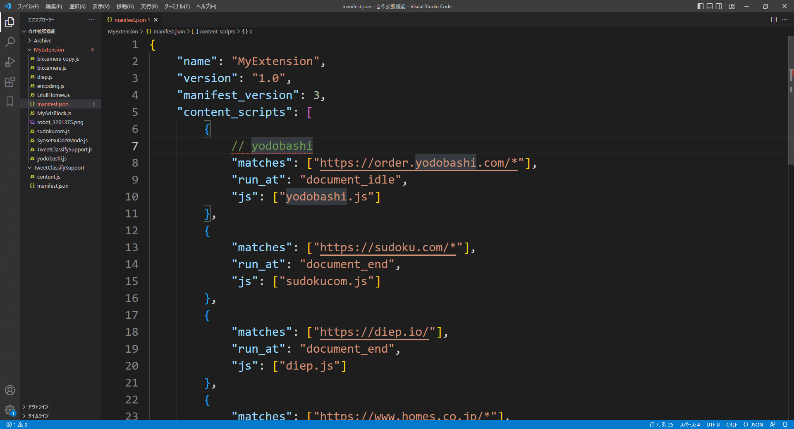
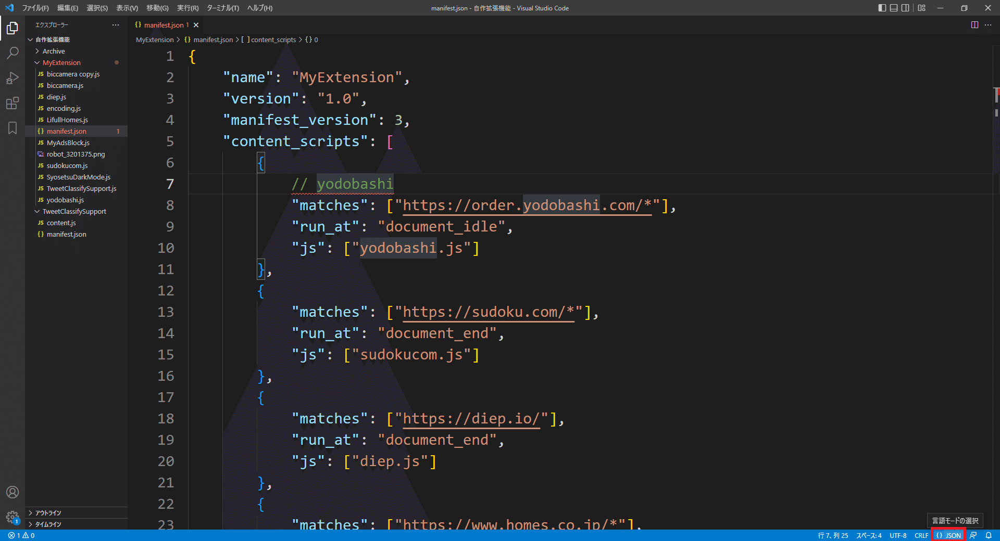
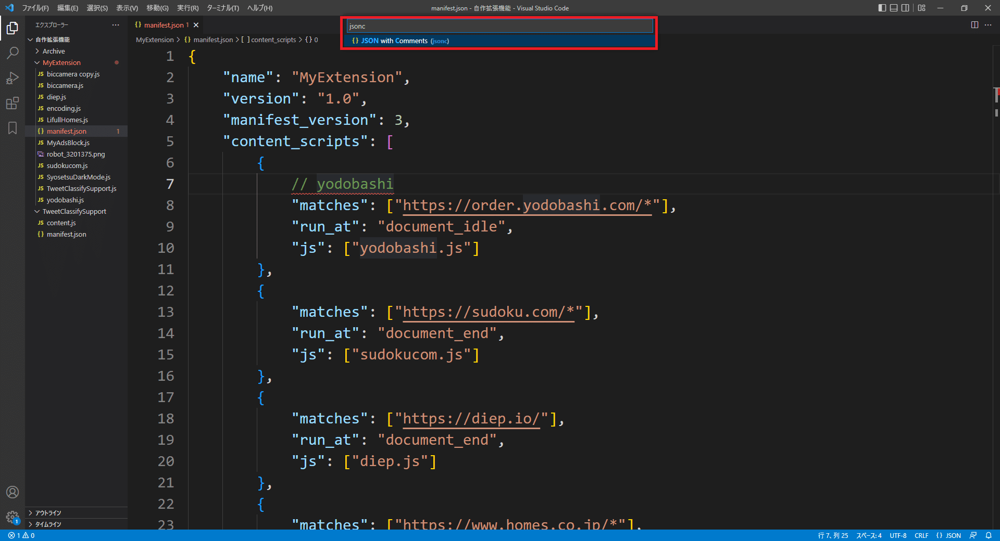
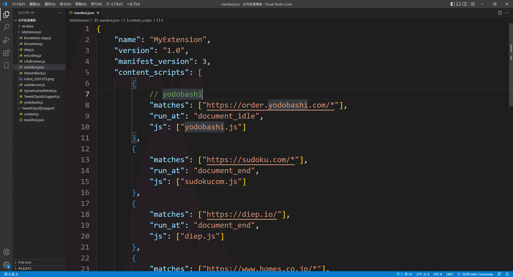

## 目的

通常はコメントを入れることができないのがjsonファイルの仕様だが
拡張機能に使われるmanifest.jsonはコメントを入れることが可能
VSCodeでは、manifest.jsonのコメントに対してもエラー表示されるのでそれを無効化する

## やりかた

7行目のyodobashiコメントがエラー扱いされている

右下のJSONというボタンを押す

上に入力ボックスが出てくるので"jsonc"と入力して
下に候補として出てくるJSON with Commentをクリック

エラーがなくなる

やったね

## 参考

[https://stackoverflow.com/questions/47834825/in-vs-code-disable-error-comments-are-not-permitted-in-json](https://stackoverflow.com/questions/47834825/in-vs-code-disable-error-comments-are-not-permitted-in-json)
