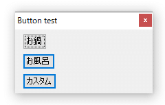

## 目的

GUIウィンドウの横幅が小さい時
タイトルバーのボタンのせいでタイトル文字が見えないので
タイトルバーのボタンを消す

## スクリプト

```ahk
Gui, +ToolWindow
```

これ加えたら最大化ボタンと最小化ボタンがなくなった



## 参考

[http://ahkwiki.net/Gui,Option](http://ahkwiki.net/Gui,Option)

## あとがき

数行でGUI作れて便利
