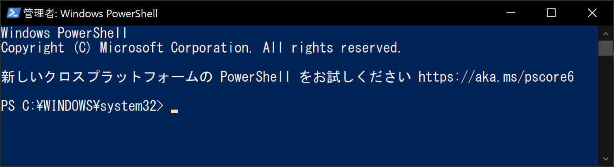
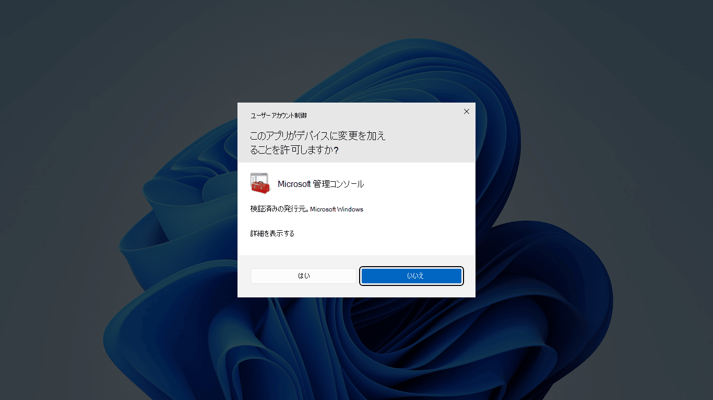
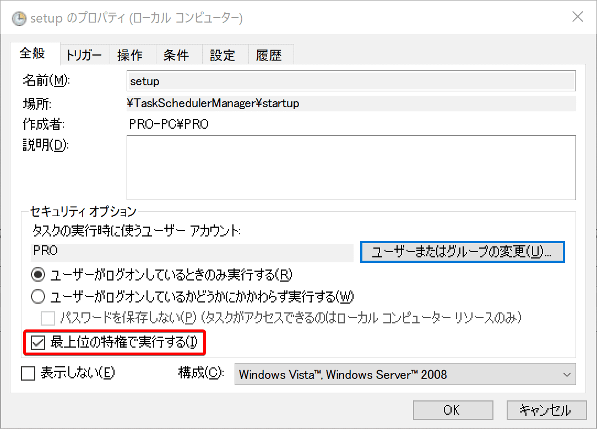

## PowerShell本体のみを立ち上げる場合

```console
powershell Start-Process powershell -Verb RunAs
```

## ps1スクリプトを実行する場合

```ps1
powershell Start-Process powershell "ファイルパス" -Verb RunAs
```

## 引数を省略しない版

```ps1
powershell -Command "Start-Process -FilePath powershell.exe -Verb RunAs"
powershell -Command "Start-Process -FilePath powershell.exe -ArgumentList \"ファイルパス\" -Verb RunAs"
```

## 解説

PowerShellから管理者権限でPowerShellを実行する方法は、[MS公式ドキュメント](https://learn.microsoft.com/ja-jp/powershell/module/microsoft.powershell.management/start-process?view=powershell-7.5#5-powershell)に記載されている
PowerShellの[Start-Processコマンド](https://learn.microsoft.com/ja-jp/powershell/module/microsoft.powershell.management/start-process?view=powershell-7.5)の `-Verb Runas` オプションを使えばいい

```powershell
# https://learn.microsoft.com/ja-jp/powershell/module/microsoft.powershell.management/start-process?view=powershell-7.5#5-powershell

Start-Process -FilePath "powershell" -Verb RunAs
```

しかし、当然Start-Processコマンドは、PowerShellで使えるコマンドであり、コマンドプロンプト(batファイル)でStart-Processを実行するとエラーとなる

```ps1
> Start-Process
'Start-Process' は、内部コマンドまたは外部コマンド、
操作可能なプログラムまたはバッチ ファイルとして認識されていません。
```

batファイルからPowerShellコマンドを使うには、PowerShellのコマンドラインパラメーターの[`-Command`](https://learn.microsoft.com/ja-jp/powershell/module/microsoft.powershell.core/about/about_powershell_exe?view=powershell-5.1#-command)を使う

```ps1
powershell -Command "Start-Process -FilePath powershell.exe -Verb RunAs"
```

## UAC(確認プロンプト)の回避方法



[UACの例](https://learn.microsoft.com/ja-jp/windows/security/application-security/application-control/user-account-control/how-it-works#the-consent-prompt)

先述のコマンドは、実行元に管理者権限がついていない場合、UACが表示される

定期実行などのケースで、これを回避したい場合は、タスクスケジューラで管理者権限つきタスクでこのbatを実行することでUACを表示させずに、PowerShellを実行権限で実行することができる



管理者権限付きタスクの例

なお、この方法をとる場合は、-Verb RunAsを使わなくとも管理者権限のまま実行できる

ただし、手動実行したいときもあるだろうし、このプログラムは管理者権限が必要なんだということを明示的に示すため（可読性のため）にも、RunAsオプションは付けておくことを推奨する

## 降格させる方法

管理者権限をもつプログラムから非管理者権限でプログラムを実行したい

非常に稀なケースではあるが、管理者権限プログラムと非管理者権限プログラムを"順番"に実行させるために、降格させたいというような場面がある

### PowerShellのStart-ProcessコマンドのVerbオプション

先の昇格方法と全く同じオプションで引数をRunAsからRunAsUserに変えると非管理者権限で実行できる

```ps1
# https://learn.microsoft.com/ja-jp/powershell/module/microsoft.powershell.management/start-process?view=powershell-7.5#-verb

# これは昇格する（管理者権限）
powershell Start-Process powershell "ファイルパス" -Verb RunAs

# これは降格する（非管理者権限）
powershell Start-Process powershell "ファイルパス" -Verb RunAsUser
```

しかし、これだとは、UACが表示されてしまう

### UACを回避して降格する方法

不思議なことにExplorer.exeを介してプログラムを実行させると降格ができる

```ps1
Explorer.exe "実行ファイルパス"
```

Explorer.exeというのは、ファイルを操作するときに使うWindowsファイルエクスプローラーのことである
セキュリティ保護のため（管理者権限必須な実行ファイルをダブルクリック実行した際に必ずUACを表示させるため）、ファイルエクスプローラー本体は管理者権限を持てないようになっている
その仕様をうまく利用したハックである

## 使用用途

タスクマネージャーやMSIAfterburnerなど、管理者権限を要するアプリの起動や、キーリマップアプリなど管理者権限で実行させておきたいアプリの自動実行が可能になる
(タスクマネージャーはGUI起動時にUACは表示されないが、管理者権限を持つ特殊アプリであり、非管理者権限プログラムから起動できない。)
(キーリマップアプリは、非管理者権限で実行している際は、管理者権限アプリ上で機能しない。）
