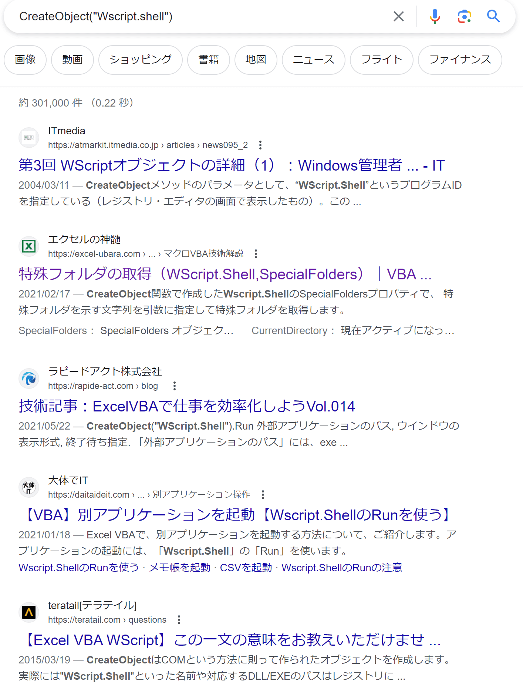
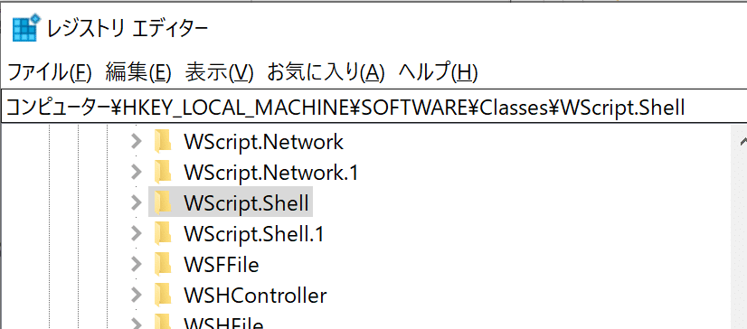

## 目的

なんかVBSで時折書く下記のコード
引数の文字列のSが大文字でも小文字でも動くけど
悩む時間が無駄なので、どっちが正しいのかはっきりさせたい

```vb
CreateObject("WScript.shell")
CreateObject("Wscript.shell")
```

## そもそもこの関数は、何をしているのか

WindowsScriptHostのCOMオブジェクトのインスタンスを作成している？
この理解で合っているのか分からないがその前提で進める

## まずは検索してみる

検索結果では、見事に大文字と小文字が交互に紹介されている
この調査は大変になりそうだ



## MSドキュメントを見てみる

[Microsoftが提供するサンプルコード](https://learn.microsoft.com/en-us/troubleshoot/windows-client/admin-development/create-desktop-shortcut-with-wsh)

同じページ内でも異なる書き方をしている
サンプル1は、大文字
サンプル2は、小文字
表記が揺れている

サンプル1

```vb
WshShell = CreateObject("Wscript.shell")
strDesktop = WshShell.SpecialFolders("Desktop")
oMyShortcut = WshShell.CreateShortcut(strDesktop + "\Sample.lnk")
oMyShortcut.WindowStyle = 3 &&Maximized 7=Minimized 4=Normal
oMyShortcut.IconLocation = "C:\myicon.ico"
OMyShortcut.TargetPath = "%windir%\notepad.exe"
oMyShortCut.Hotkey = "ALT+CTRL+F"
oMyShortCut.Save
```

サンプル2

```vb
WshShell = CreateObject("Wscript.shell")
strDesktop = WshShell.SpecialFolders("Desktop")
oMyShortcut = WshShell.CreateShortcut(strDesktop + "\Sample.lnk")
oMyShortcut.WindowStyle = 3 &&Maximized 7=Minimized 4=Normal
oMyShortcut.IconLocation = "C:\myicon.ico"
OMyShortcut.TargetPath = "%windir%\notepad.exe"
oMyShortCut.Hotkey = "ALT+CTRL+F"
oMyShortCut.Save
```

上記の結果からサンプルの正誤を確認するのは無理だと判断

## 正しい引数とは？

そもそも"Wscript.shell"という引数はどこからきているのか

検索をかけると下記の文章を発見

> WSHで，CreateObject() の引数を不思議に思ったことはあるだろうか？
> "InternetExplorer.Application" とか "Excel.Application" など，
> 別のアプリ（自動操作したいCOMオブジェクト）を特定するための文字列が入り，これを **ProgID** と呼ぶ。

[モバイル通信とIT技術をコツコツ勉強するブログ](https://computer-technology.hateblo.jp/entry/2016/01/06/WSH%E3%81%AECreateObject%E9%96%A2%E6%95%B0%E3%81%AE%E5%BC%95%E6%95%B0%E3%81%AECOM%E8%AD%98%E5%88%A5%E5%AD%90%E3%80%8CProgID%E3%80%8D%E3%80%8CCLSID%E3%80%8D%EF%BC%88GUID%EF%BC%89%E3%81%A8)

メソッドの引数は、COMオブジェクトの作成に使うProgIDというらしい？

## 正しいProgIDとは？

では正しいProgIDを探すためにマイクロソフトのページを見てみる

> プログラム識別子 (ProgID) は、CLSID に関連付けることができるレジストリ エントリです。
> `HKEY_LOCAL_MACHINE\SOFTWARE\Classes\{ProgID}`

[ProgID Key - Microsoft Document](https://learn.microsoft.com/en-us/windows/win32/com/-progid--key)

レジストエントリってなんだよ

> レジストリは階層構造となっており、レジストリ エディターでは左ペインにツリーとして階層構造が表示される。 ファイルシステムなら「フォルダー」に相当するものが「キー」、ファイルに相当するものが「レジストリエントリ」と呼ばれる。

[通信用語の基礎知識](https://www.wdic.org/w/TECH/%E3%83%AC%E3%82%B8%E3%82%B9%E3%83%88%E3%83%AA)

なるほど、どうやらレジストリのファイルに相当する場所の名前が正解らしい

## レジストリを確認してみる

大文字のWSript.Shellがあった
小文字のWscript.Shellはなかった



## 結論

これが正解

```vb
CreateObject("WScript.shell")
```

## あとがき

CreateObject("WScript.shell")
これがWindowsScriptHostのCOMオブジェクトのインスタンスを作成している
という理解が間違っていたら、今回の結論も間違っていることになる

検索してもよく分からないことってどうしたらいいんだろうか

でも、大文字小文字どっちでも動くので
自分なりの正解を決められて今後悩まずに済むようにできたので
一応目的は達成できたかなと思う
