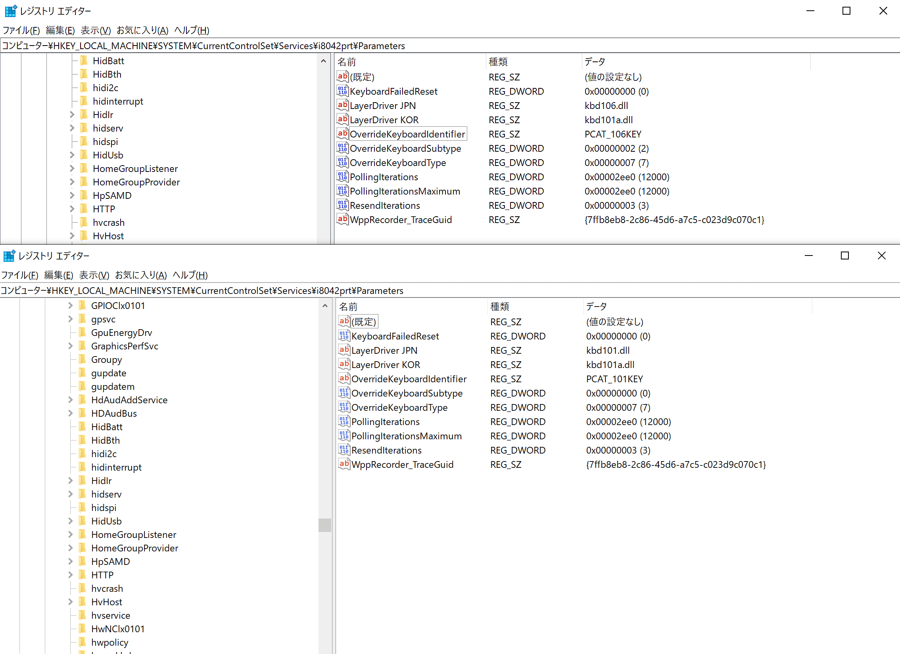

## 目的

ブックマークを整理していたら、以前調べた貴重な情報をメモしていないことに気づいた
表題の件だが、この[リンク先](https://www.nslabs.jp/windows-how-to-change-keyboard-layout.rhtml)にしか見つけられなかったので
万が一なくなったら困るのでアーカイブとして引用の記事を残しておく

## 学べる事

IMEのハードウェアキーボードレイアウトのレジストリ保存場所
おそらく日本語IMEのみの話なので、英語で検索してもまるでヒットしない
日本語でも当時一件しか見つからなかった記憶がある

## 引用

> この作業の前に、上記の設定画面からハードウェアキーボードレイアウトを少なくとも1回、変更しておくこと。この操作によりレジストリにエントリが作られる. あと、別の言語を追加し, QWERTY キーボードを追加して切り替えられるようにしておくと, もしもの際に役に立つ。
>
> 変更するレジストリの場所は `HKEY_LOCAL_MACHINE\SYSTEM\CurrentControlSet\Services\i8042prt\Parameters`. LayerDriver JPN というズバリ日本専用の key がある. 106キーボードだと kbd106.dll という値になっているはず。
>
> これを kbddv.dll に書き換えるだけ。次の内容で .reg ファイルを作り、レジストリエディタでインポートしてもよい。

設定変えた前後で確かに変わってるねえ

## おまけ

これも知らなかったのでおもしろい

> Microsoft Keyboard Layout Creator を使えば、どのような配列も作れる。しかも, .dll ファイルのインストーラまで作ってくれる.
