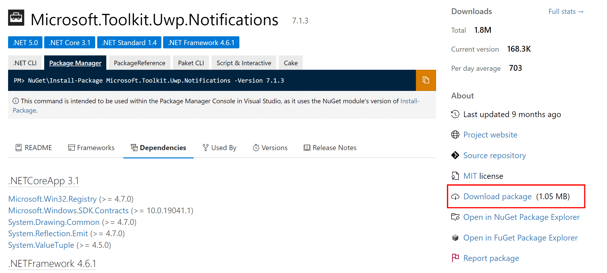

## 目的

ToastContentBuilderでカスタムトースト通知を短く記述する
BunrtToastは、InlineImageに対応してなかったり、AppLogoのCropなしができなかったり、機能が足りなかった

## 必要な知識（ハマったところ）

### Install-Packageがうまくできないものがある？

PowerShellから「Install-Package Microsoft.Toolkit.Uwp.Notifications」を打ってもうまくインストールできなかった（原因不明）

### .nupkgは.zipに拡張子直したら解凍できる

[Microsoft.Toolkit.Uwp.Notifications](https://microsoft.toolkit.uwp.notifications/)のDownload packageを押すと
.nupkgが保存される。
なにこの拡張子と思ったが、7-zipの機能で「右クリック→展開」で解凍できた



### dllは依存先もないとダメ

dllファイルは1つだけで独立していなくて
処理の中で他のdllを参照していることがあり
今回でいうと必要なのは下記2つだった
・Microsoft.Toolkit.Uwp.Notifications.dll
・System.ValueTuple.dll

### 依存先も一括で入手するにはVisual Studioが便利

・VisualStudioでC#のコンソールアプリのテンプレートで新規プロジェクト作成する
・参照のNugetパッケージ管理からMicrosoft.Toolkit.Uwp.Notificationsを探して参照に追加
・実行ボタンの左のプルダウンでReleaseを選択してビルド
・`\ConsoleApp1\bin\Release`に必要dllが生成される
・dllをゲット

## スクリプト

```ps1
using assembly ".\lib\Microsoft.Toolkit.Uwp.Notifications.dll"
using namespace Microsoft.Toolkit.Uwp.Notifications
using namespace System

$toaster = [ToastContentBuilder]::new()
$toaster = $toaster.AddText($TextString)
$toaster.Show()

exit
```

## メモ

### `using assembly` vs `Import-Module` vs `Add-Type`

どれでもdll読み込みできる

### `New-Object` vs `[ClassName]::new()`

どっちでもインスタンス作成できる

### `[ClassName]`

TypeAcceleratorという名前 型の指定に使う
staicメソッドはイスタンス作成しなくても`[ClassName]::do()`で呼び出せる

## 参考

[https://learn.microsoft.com/en-us/windows/apps/design/shell/tiles-and-notifications/send-local-toast?tabs=uwp](https://learn.microsoft.com/en-us/windows/apps/design/shell/tiles-and-notifications/send-local-toast?tabs=uwp)

[https://learn.microsoft.com/en-us/windows/apps/design/shell/tiles-and-notifications/adaptive-interactive-toasts?tabs=toolkit](https://learn.microsoft.com/en-us/windows/apps/design/shell/tiles-and-notifications/adaptive-interactive-toasts?tabs=toolkit)

[https://learn.microsoft.com/en-us/dotnet/api/microsoft.toolkit.uwp.notifications.toastcontentbuilder?view=win-comm-toolkit-dotnet-7.0](https://learn.microsoft.com/en-us/dotnet/api/microsoft.toolkit.uwp.notifications.toastcontentbuilder?view=win-comm-toolkit-dotnet-7.0)

## あとがき

dllもnugetも.NETも何にも知らなかったので、1つ進めるごとに色々調べなきゃいけなくて大変だった
