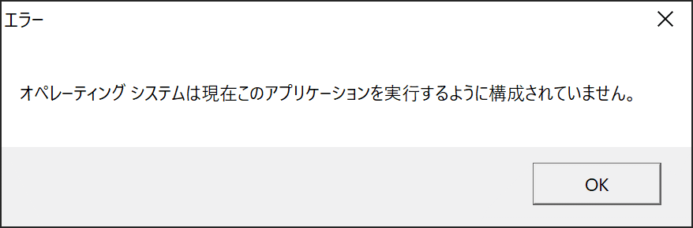
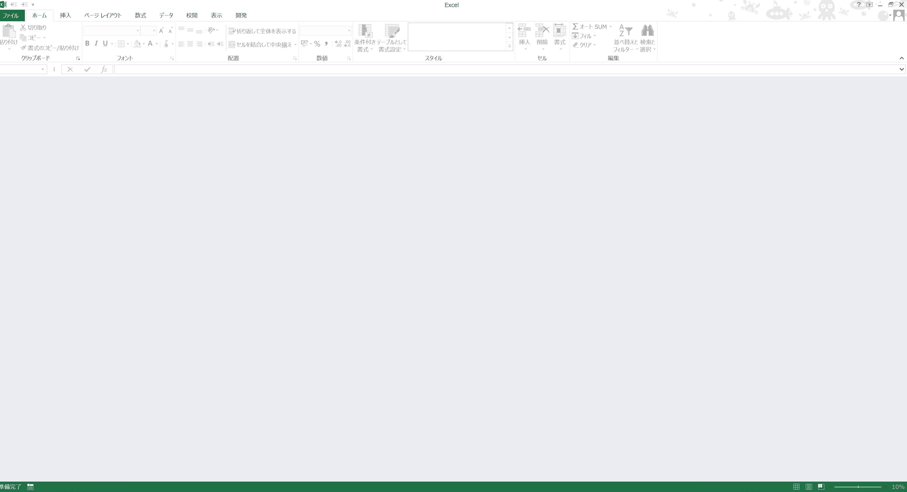
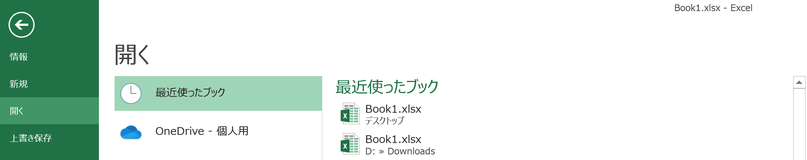
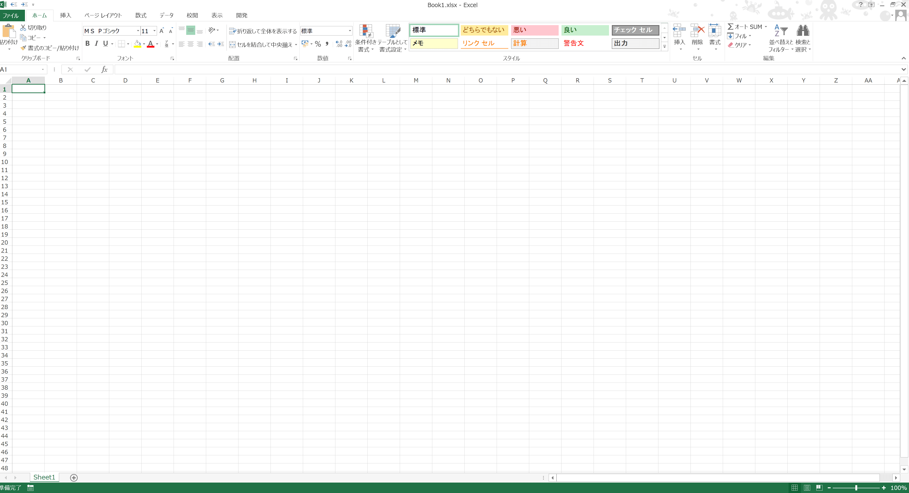
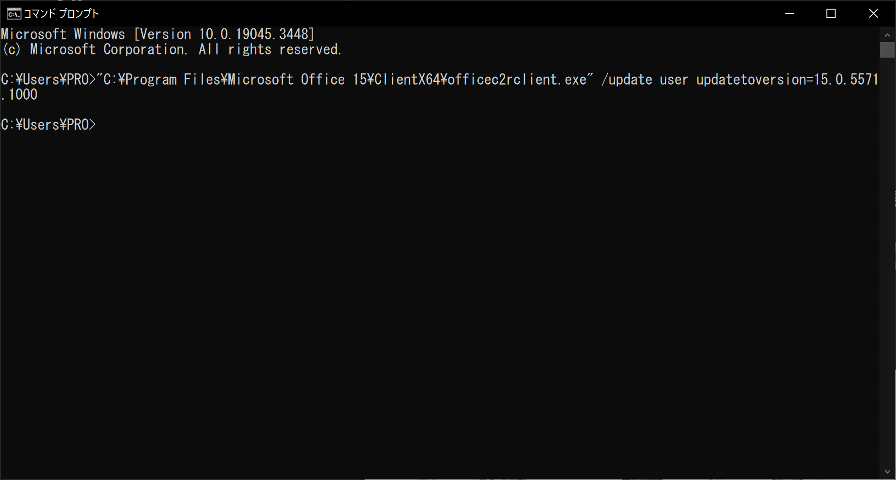
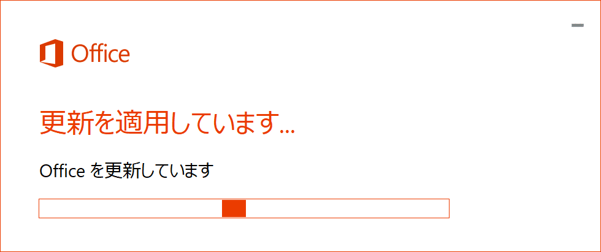
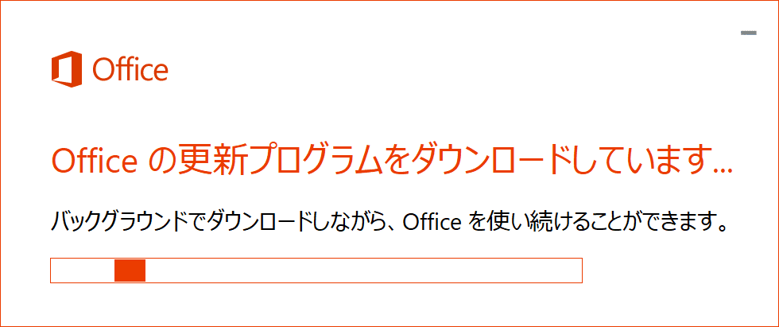
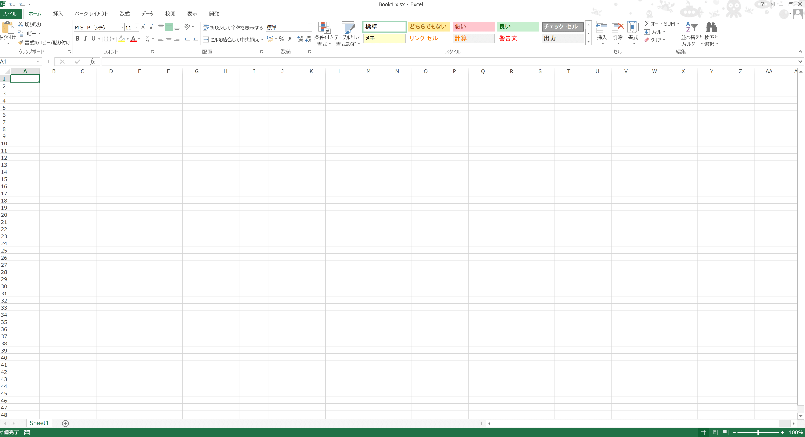

## 現象

下記の通りExcelがまともに使えない

### excel.exeが開かない



「オペレーティング システムは現在このアプリケーションを実行するように構成されていません。」
というメッセージが表示されてしまう

### xlsx(xlsm)ファイルを開くとグレーアウト



## 応急処置方法

### 最近使ったブックから開くとちゃんと開ける

改善前にスクショとり忘れたので下記は例





## 不具合をなおす方法

コマンドプロンプトで下記コマンドをうつ
（Excelのバージョンを下げる）

```cmd
"C:\Program Files\Microsoft Office 15\ClientX64\officec2rclient.exe" /update user updatetoversion=15.0.5571.1000
```









無事に開けるようになった

再発防止のために自動更新オフにすることも必要

コマンドプロンプトの開き方と
Excel自動更新オフのやり方は下記のツイッター参照

## 参考

[https://detail.chiebukuro.yahoo.co.jp/qa/question_detail/q13286268758](https://detail.chiebukuro.yahoo.co.jp/qa/question_detail/q13286268758)

[https://twitter.com/nissinplastics/status/1704665273813643748?s=20](https://twitter.com/nissinplastics/status/1704665273813643748?s=20)

[https://learn.microsoft.com/ja-jp/officeupdates/update-history-office-2013](https://learn.microsoft.com/ja-jp/officeupdates/update-history-office-2013)

## 調べ方メモ

最近起きた不具合なので、最近の記事のみ探したくて
googleの期間指定検索が役立った
[https://www.google.com/search?q=office+2013+%E9%96%8B%E3%81%8B%E3%81%AA%E3%81%84&tbs=cdr%3A1%2Ccd_min%3A9%2F19%2F2023%2Ccd_max%3A9%2F21%2F2023](https://www.google.com/search?q=office+2013+%E9%96%8B%E3%81%8B%E3%81%AA%E3%81%84&tbs=cdr%3A1%2Ccd_min%3A9%2F19%2F2023%2Ccd_max%3A9%2F21%2F2023)
