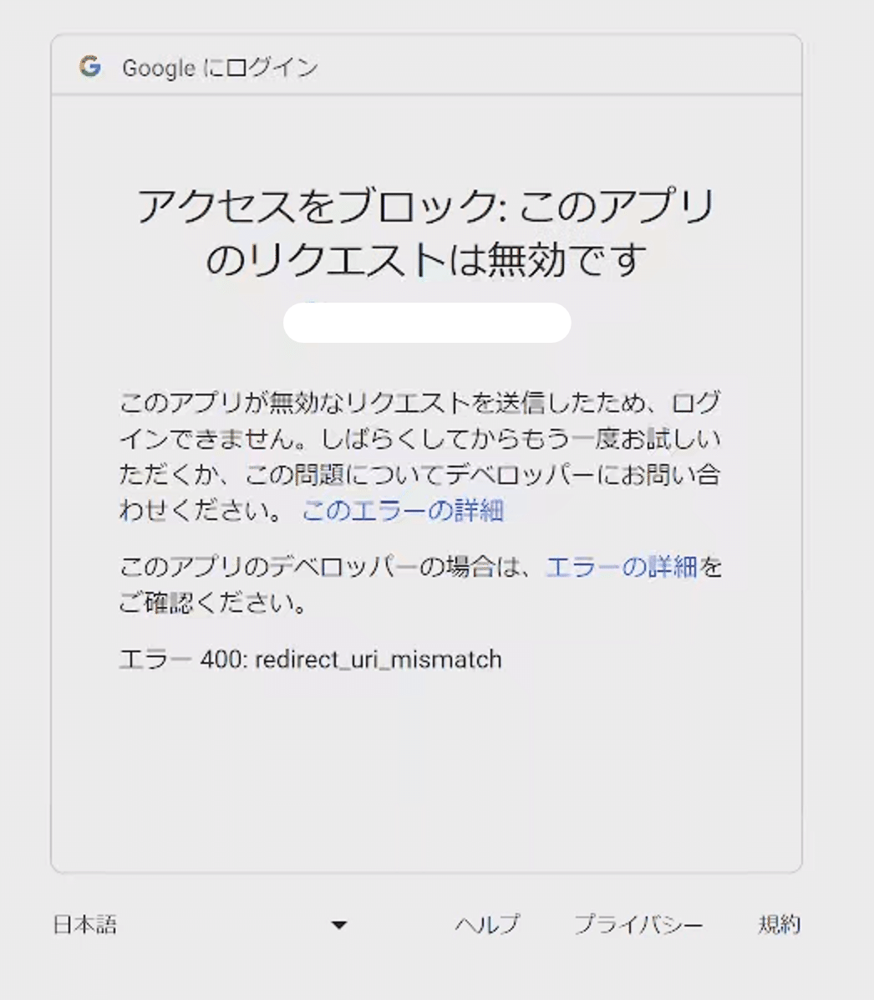
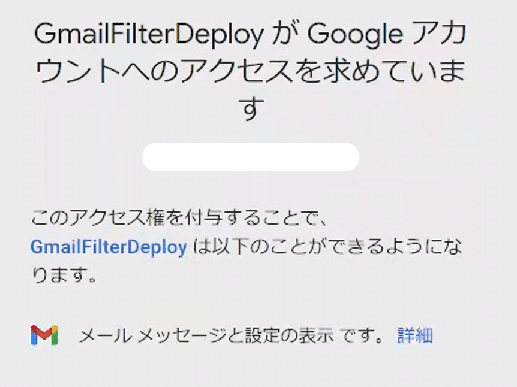
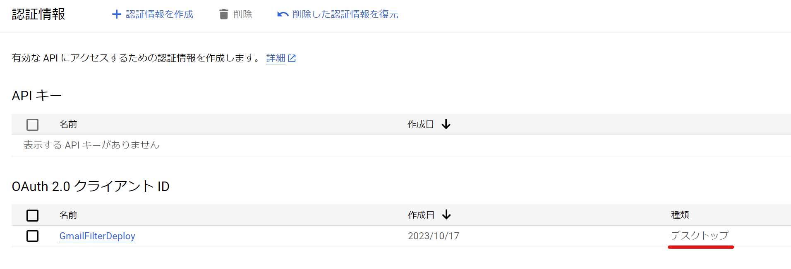

## 目的

XMLで管理しているGmailFilterをスクリプトでデプロイするために
PythonでGmailAPIを使う必要がある

## 状況

適当なサイトで手順を習い、GCPプロジェクトの作成、APIの有効化、認証の下準備、Pythonサンプルコードの取得、実行を行い、エラーメッセージが表示された

## エラー内容

アクセスをブロック:このアプリのリクエストは無効です このアプリが無効なリクエストを送信したため、ログインできません。しばらくしてからもう一度お試しいただくか、この問題についてデベロッパーにお問い合わせください。 エラー400:redirect_uri_mismatch

## このエラーメッセージで調べてみた

解決法がよく分からなかった

## 公式のクイックスタートの通りにやり直した

こいつのことをすっかり忘れていた
これ以上ないくらい便利

[https://developers.google.com/gmail/api/quickstart/python?hl=ja](https://developers.google.com/gmail/api/quickstart/python?hl=ja)

## できた

## 原因はなんだったのか

アプリケーションの種類がウェブアプリになっていた
デスクトップに設定して作り直したらできた

そこが大事な設定だったのか
