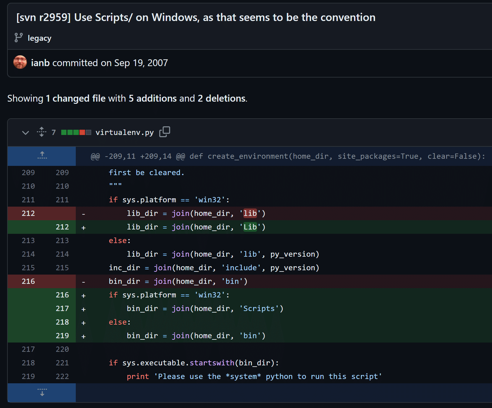

## 調べてみた

疑問に思うのは世界中同じ
下記stackoverflowに同じ質問があったので見てみる

> コミットメッセージに真実が書かれています

https://stackoverflow.com/questions/43826134/why-is-the-bin-directory-named-differently-scripts-on-windows

とのこと
いったいどんなコミットメッセージなんだい

## 問題のコミットメッセージ

https://github.com/pypa/virtualenv/commit/993ba1316a83b760370f5a3872b3f5ef4dd904c1

> **コミットメッセージ：
> Use Scripts/ on Windows, as that seems to be the convention
> **WindowsではなんかそういうルールらしいのでScriptsと命名する

もともと分けていたわけじゃなくて、このコミットでわざわざ分けてしまったみたい

## 15年越しのレビュー

> On behalf of everyone who has had to work around this while writing an otherwise trivial portable ci/test/build script, I would like to express my distinct absence of gratitude.
> 移植可能スクリプト作成時に、この問題で頭を悩ませた人を代表してお伝えします。
> どうもありがとう。

> there is no convention in windows where people use Scripts instead of bin or Lib instead of lib, this change makes absolutely no sense and just makes everything harder, if you want to name things stick to actual conventions and if there aren't any then choose consistency
> Windowsにそんなルールはありません。この変更は意味がありません。

## レビューを受けたコミット主の反応

> Whew, tough but fair review. But 15 years too late!
> うーん、厳しいが公平なレビュー。しかし、15年は遅すぎました！

## あとがき

どんなやつがやらかしたのかと思ったら
virtualenvを作った偉大な本人だった
しかし2007年なんてそんな大昔に作ってたものだったとは知らなかった
とても便利なものを世に発信したのに、15年も経って引き返せないところまできてから、文句言われて、へこむだろうに
ちゃんと返信してあげるところに器の大きさを感じる
