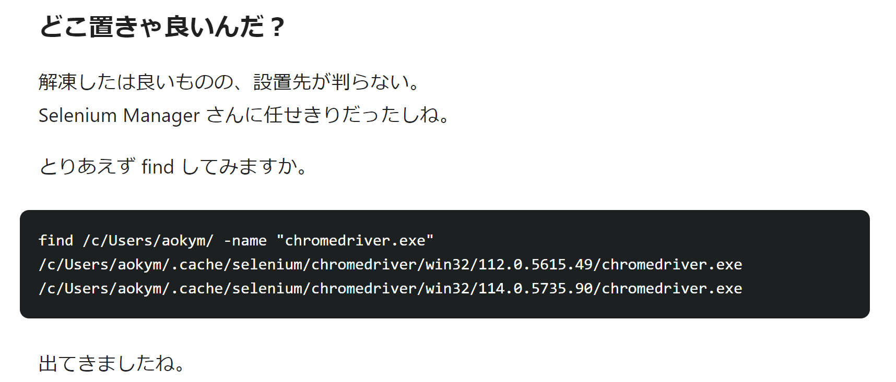
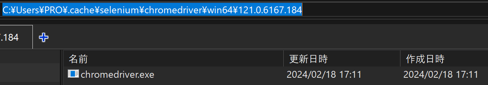

## 目的

selenium 4 を理解する

## 経緯

selenium 4 が書きやすそうなので移行する

```py
# selenium3の常套句だったこれが使えなくなってる!
webdriver.Chrome(executable_path=ChromeDriverManager().install())

# これでできるらしい
webdriver.Chrome(service=ChromeService(ChromeDriverManager().install()))

# これだけでもできちゃった！
webdriver.Chrome()
```

## chrome driverをインストールしてないのに使えた

どうやら`selenium manager`というデフォルト機能がchrome driver managerみたいに最新driverを確認して自動インストールしてくれるらしい

でも、どこにあるんだろう

## 公式リファレンス

> ドライバー バイナリは、ローカル キャッシュ フォルダー ( ~/.cache/selenium) に保存されます。

[https://www.selenium.dev/documentation/selenium_manager/](https://www.selenium.dev/documentation/selenium_manager/)

ローカル キャッシュ フォルダー！？
初めて聞く名前に困惑
プロジェクトフォルダ配下を見てもドライバーは見当たらないので場所が分からない

## 日本語記事を発見



[https://qiita.com/aokym/items/bf4a74da767cd676a2c8](https://qiita.com/aokym/items/bf4a74da767cd676a2c8)

chromedriver.exeでファイル検索して探した模様
パイセンさすがです

これによるとユーザーフォルダ配下っぽい！
自分のパソコンで見てみる



あった
やっぱりwebdriver.Chrome()を動かしたときにselenium managerが自動インストールしてくれてたみたい
発見時刻2024/02/18 18:16 なのでドライバーファイルの作成日時も記憶と合ってる

## selenium manager

> [バージョン4.6.0](https://www.selenium.dev/blog/2022/introducing-selenium-manager/)以降、Selenium のすべてのリリース (Java、JavaScript、Python、Ruby、および .Net) には**Selenium Manager**が同梱されています。[Selenium Manager は](https://www.selenium.dev/documentation/selenium_manager/)、Selenium の自動ドライバー管理を提供するバイナリ ツール (Rust で実装) です。[Selenium Manager](https://www.selenium.dev/documentation/selenium_manager/)はまだベータ版ですが、Selenium の関連コンポーネントになりつつあります。

[https://www.selenium.dev/blog/2023/whats-new-in-selenium-manager-with-selenium-4.11.0/](https://www.selenium.dev/blog/2023/whats-new-in-selenium-manager-with-selenium-4.11.0/)

## 所感

selenium 4 のselenium managerの情報を見つけるのが非常に難しかった
日付指定検索しても未だにselenium 3 の時代の知識を流用してる記事などがあるため

でも selenium manager マジ便利！
