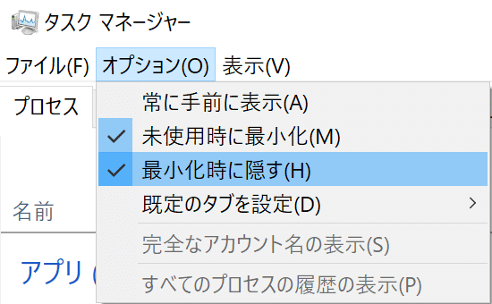

## 目的

スタートアップでタスクマネージャーをタスクトレイに開く

## スクリプト

[https://gist.github.com/CatBraaain/2995272637a0b2351ca7b1aab57772bb](https://gist.github.com/CatBraaain/2995272637a0b2351ca7b1aab57772bb)

## スクリプト解説

```ps1
using namespace System.Security.Principal
$isAdmin = ([WindowsPrincipal][WindowsIdentity]::GetCurrent()).IsInRole("Administrators")
if (!$isAdmin) {
    Start-Process powershell.exe "-File ""$PSCommandPath""" -Verb RunAs; exit;
}
```

管理者権限実行でなければ、UACで昇格
タスクマネージャーはUACが表示されなくても管理者権限がついているので、管理者権限のスクリプトでないとウィンドウ操作（最小化）ができない

```ps1
Start-Process -FilePath "Taskmgr.exe"
While (!($process = (Get-Process | ? {($_.ProcessName -eq "Taskmgr") -and $_.MainWindowTitle}))) {
    SLEEP 0.5
}
```

タスクマネージャーを実行し、ウィンドウが開くまで待機

$process = xxx
の戻り値はxxxになるのでget-processの戻り値を利用すると同時に代入を行ってる

```ps1
$signature = '[DllImport("user32.dll")] public static extern bool ShowWindowAsync(IntPtr hWnd, int nCmdShow);'
$showWindowAsync = Add-Type -MemberDefinition $signature -Name "Win32ShowWindowAsync" -Namespace Win32Functions -PassThru
$showWindowAsync::ShowWindowAsync($process.MainWindowHandle, 6)
```

windows apiでウィンドウを最小化
このスクリプトよく見かけるけど公式に[サンプルコード](https://learn.microsoft.com/ja-jp/powershell/module/microsoft.powershell.utility/add-type?view=powershell-7.4#:~:text=%E4%BE%8B%204%3A%20%E3%83%8D%E3%82%A4%E3%83%86%E3%82%A3%E3%83%96%20Windows%20API%20%E3%82%92%E5%91%BC%E3%81%B3%E5%87%BA%E3%81%99)として乗ってる

$processはさっきwhileで代入したやつ

```ps1
# make sure to check task manager Option 'Hide when minimised'
```

コメント
オプションのチェックをするように



## メモ

```ps1
# powershell
Start-Process taskmgr.exe -WindowStyle Minimized

# cmd
start /min taskmgr.exe
```

上記の様に最初から最小化して起動してもタスクバーに入るだけ
システムトレイに入れるには、通常起動してから最小化する必要がある
