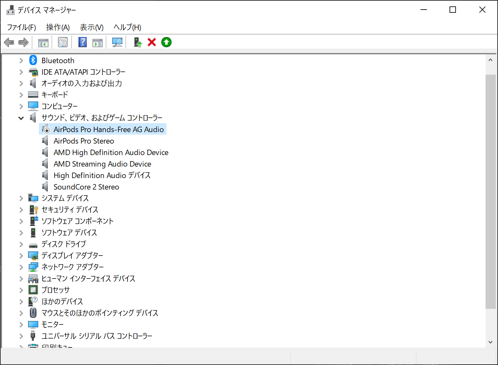

## 経緯

AirPodsPro2を購入し、Windows10に接続してみたら
妙に音質が悪い
Windowsの右下の音声デバイス選択画面には、`ヘッドセット`が選択されている。`ヘッドホン`を選択しても何も聞こえない

## 直し方

ハンズフリーモードのドライバーを無効化する
AirPods Pro Hands-Free AG Audio を右クリックして無効化

## 所感

他にもやり方あったはずなんだけど、思い出せないし、調べても出てこなかった
ハンズフリーモードを無効化すると内蔵マイクが使えなくなるが、どうせマイクは別のを使うので、これでよし
