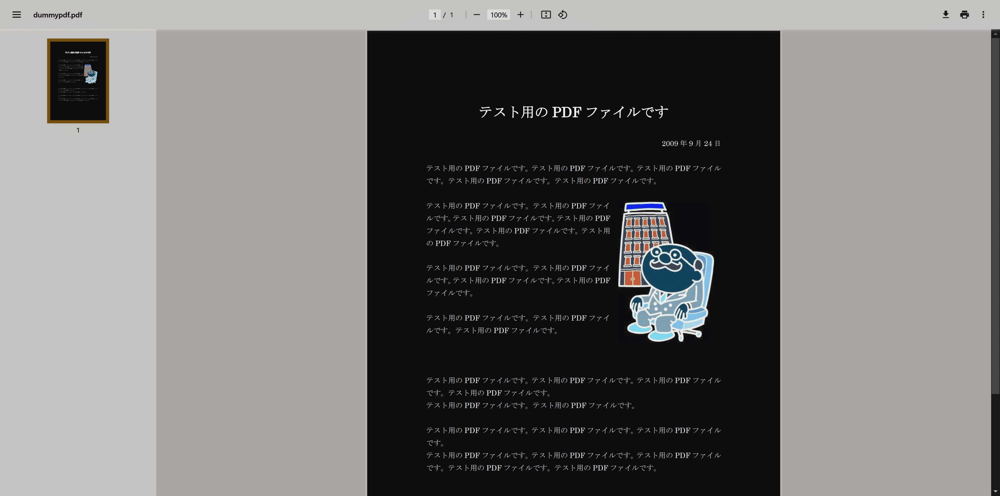
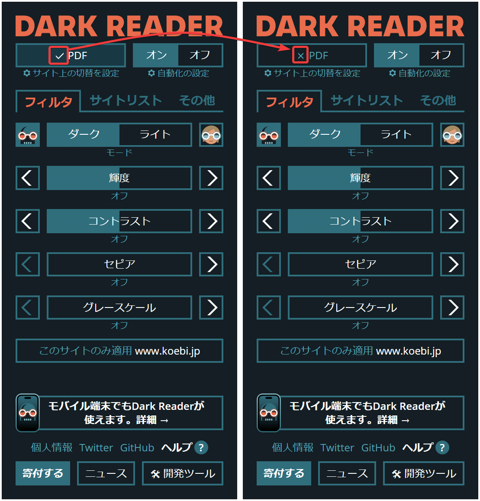
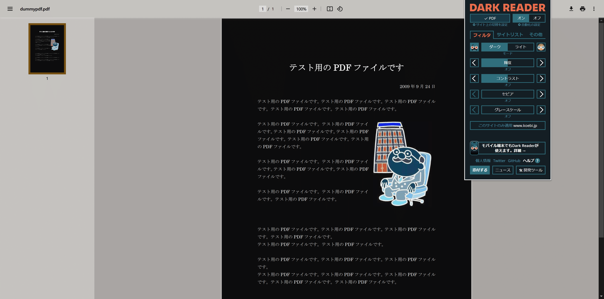
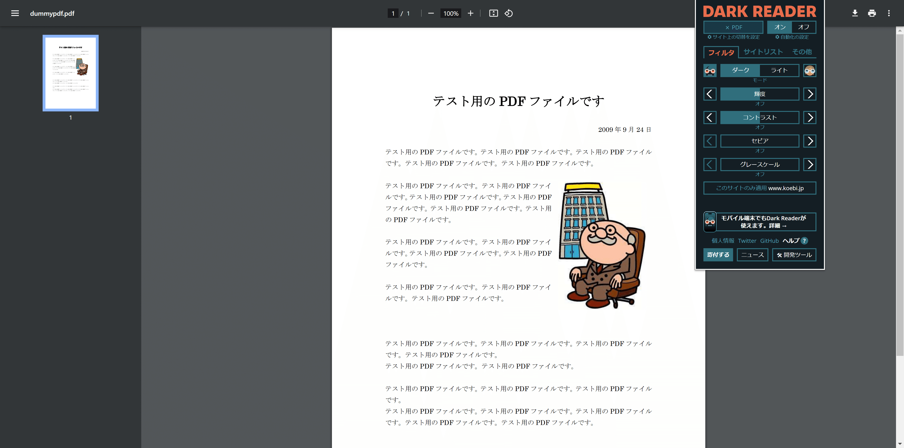

## 現象

ChromeでPDFを開くと色がおかしくてとても見にくい
PDFの色を正しく表示させたい

## 原因

darkモード表示をするchrome拡張機能が色を変更させている

## 修正方法

chrome拡張機能である dark reader をオフにするか
もしくは、dark reader の設定でPDFのみ色反転させないようにする

### 修正前

### 修正後

## 参考

### dark readerが原因であるという指摘

[https://www.reddit.com/r/chrome/comments/yz4f9m/all_pdfs_are_color_inverted/](https://www.reddit.com/r/chrome/comments/yz4f9m/all_pdfs_are_color_inverted/)

### テストPDFとして利用したもの

[https://www.koebi.jp/archives/003/201808/dummypdf.pdf](https://www.koebi.jp/archives/003/201808/dummypdf.pdf)

## 経緯

はじめに調べたら、adobe pdf のchrome拡張機能で解決できるとのことで、使ってみたら、確かに色問題は解決したけど。なぜかadobe拡張機能を通すと表示URLが勝手に変更されるのが気に入らなくてやっぱりやめた。

次に、PDFをローカルにダウンロードしてからchromeで開くとなおるという手法を発見。でも、毎回ダウンロードするのが面倒で不採用。

そして最後に見つけたのが本手法である。

## あとがき

簡単になおってよかった
