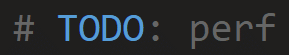
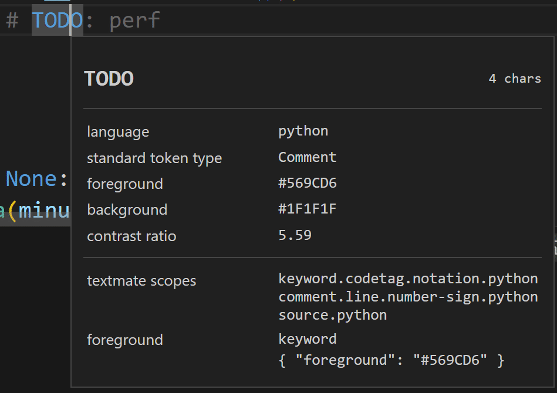
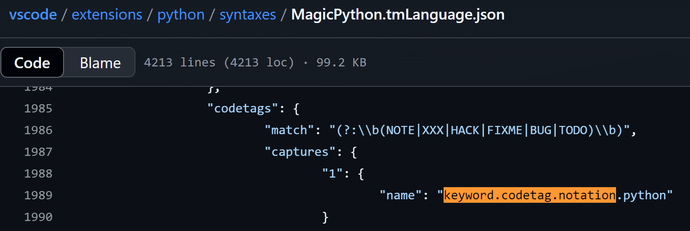
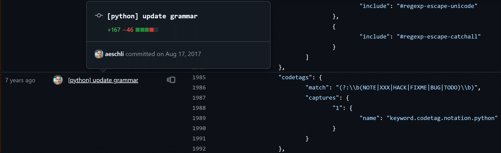

## vscodeでTODOコメントがハイライトされている

pythonでTODOコメントを入れたところハイライトされていることを確認

## 拡張機能ではないんだが

下記のような拡張機能でハイライトできることは知っていたが
それらをインストールしていないことを確認した

[https://marketplace.visualstudio.com/items?itemName=wayou.vscode-todo-highlight](https://marketplace.visualstudio.com/items?itemName=wayou.vscode-todo-highlight)

## 調査

コマンドパレットで`inspect editor tokens and scopes` を起動した

TODOコメントのところにカーソルを合わせてtextmate scopesを確認すると
`keyword.codetag.notation.python`というスコープになっているのが分かった

keyword.codetag.notationのキーワードでgoogle検索すると

MagicPythonの文法ファイルが出てきた！

中身をよく確認してみる

NOTE,XXX,HACK,FIXME,BUG,TODOの6つのキーワードがハイライトされる設定になっていることを確認

## 前からそうだったっけ？

MagicPythonでは2017年8月からTODOハイライトを導入
vscodeがMagicPythonを統合したのもそれより前っぽいので

つまり
ずーっと前からそういう仕様だったのか
シラナカッタ！

## 結論

vscodeでpythonにおいてTODOコメントがハイライトされるのは、vscodeの標準機能であるMagicPythonによるもの
