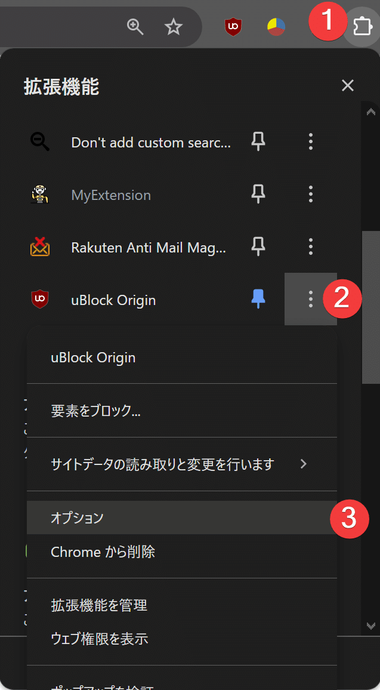
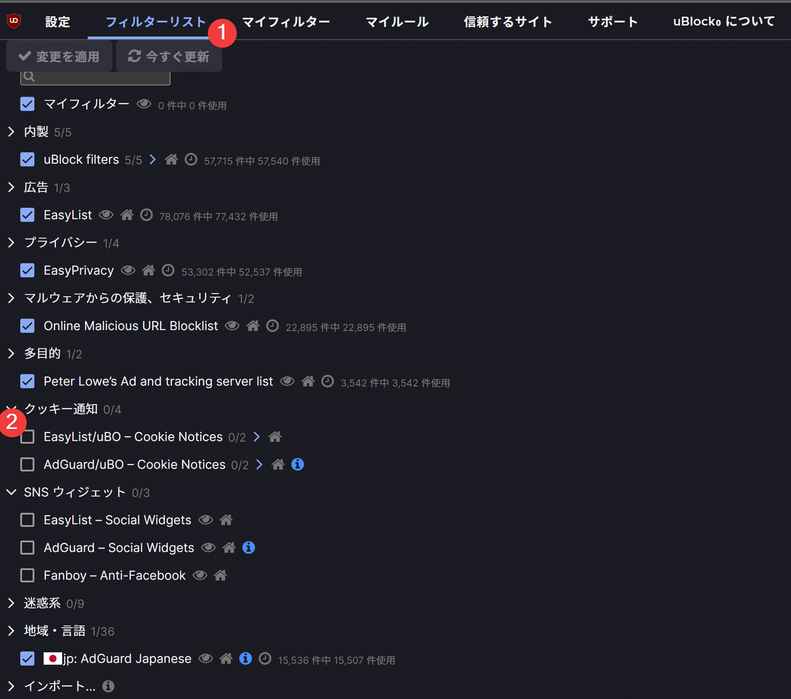
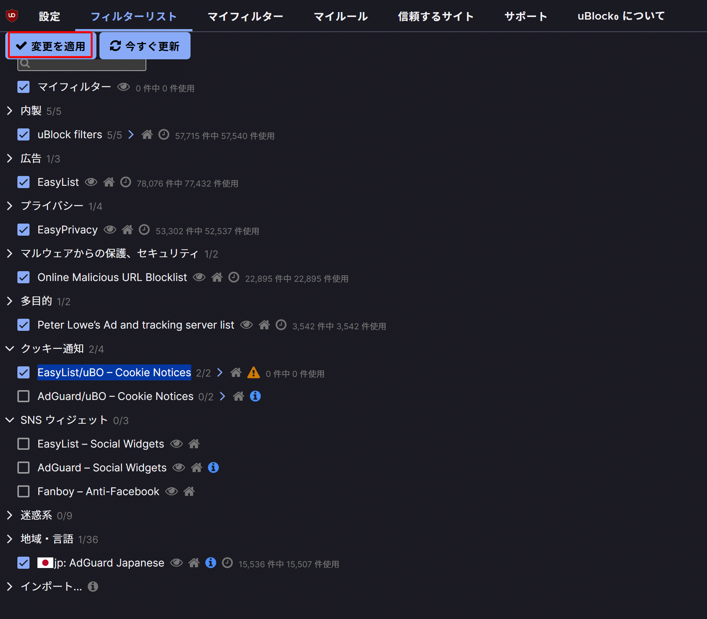

## 目的

ウェブサイトを閲覧すると右下に
クッキーの使用を許可しますか
みたいに聞いてくるやつ
Yesを押すわけがないし、そもそもその選択に尊重されてないでしょ
っていつも思うのが無駄なのでそもそも最初から見えないようにしたい

## 調査

cookies banner blocker
みたいなワードで調べてみたけどどうもしっくりこない
そもそも要素を非表示にするだけなんだから広告ブロック系ツールの拡張フィルターで対応できるんじゃないかと思って調べてみたら
私が使ってるublock originの拡張フィルターに用意されてた

## ublock originでの設定方法

まずはchrome系ブラウザでこれをインストール

[https://chromewebstore.google.com/detail/ublock-origin/cjpalhdlnbpafiamejdnhcphjbkeiagm?hl=ja](https://chromewebstore.google.com/detail/ublock-origin/cjpalhdlnbpafiamejdnhcphjbkeiagm?hl=ja)

拡張機能の設定画面へアクセス

フィルターリスト=>EasyList/uBO – Cookie Noticesにチェックを入れて

変更を適用ボタンを押下したら終わり

## 所感

広告ブロック系ツール最高だな
拡張フィルターはあまり調べたこともなかったけど
思い返してみれば自作してる非表示系拡張機能とかフィルター作成で代用できそうなので時間があるときに試してみたい
