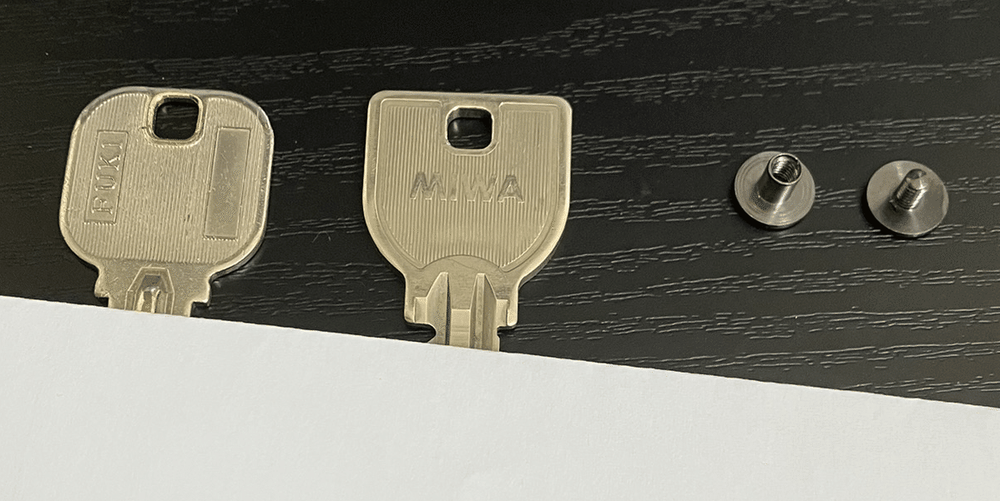
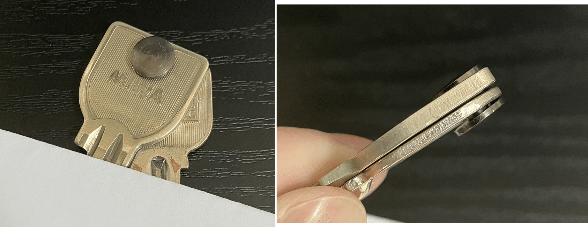

## 目的

希望に合うキーケースが欲しい

## キーケースに求めること

- 鍵2つのみを収納すること
- できる限り薄くて小さいこと
- 片手で扱えること
- 安いこと
- がちゃがちゃしないこと

## 市販品を調べた

主ワード: キーケース、キーホルダー、鍵ケース
副ワード: 薄い 小さい メタル

その他ワード: keybar, keydisk

### 最も理想に近かった商品

[https://www.amazon.co.jp/dp/B08KH1XF54/](https://www.amazon.co.jp/dp/B08KH1XF54/)

安くて小さくてイメージとして合ってるが
標準の部品だと薄さを追求できなさそう

## 自作

部品の検索ワード: 組ネジ、シカゴスクリュー

## 購入した部品

[https://item.rakuten.co.jp/gadgetstore/screw_post_sample/?variantId=4screw_post_5BNx1p](https://item.rakuten.co.jp/gadgetstore/screw_post_sample/?variantId=4screw_post_5BNx1p)

88円+送料290円 = 378円 である

## 組み立て

\*セキュリティのため、鍵穴部分は紙で隠してる

### 1. 鍵2つと組ネジを並べる

### 2. 組ネジを穴に通して締める

終わり

## 所感

作ってから気づいたけどこれキーケースじゃなくてキーホルダーだ
でも小さくてガチャガチャしなくてスライド式で片手で扱えて安いので
これで様子を見て、必要に応じて外側を皮で覆うなど発展させてみたい
