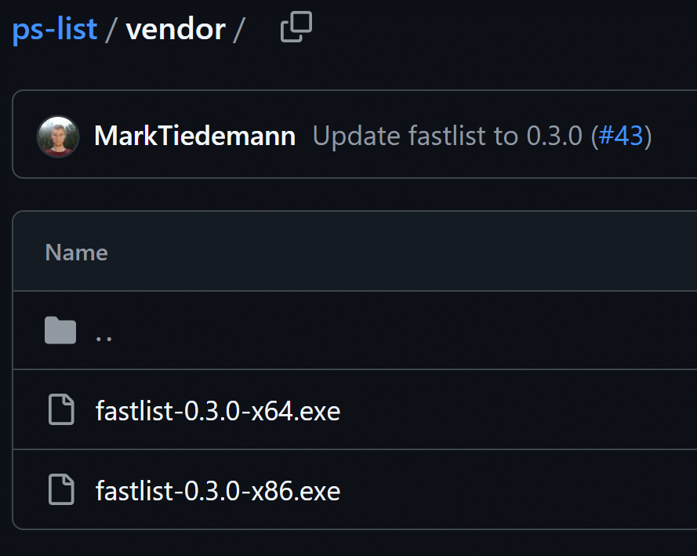

## 問題

[fkill](https://www.npmjs.com/package/fkill)というパッケージを含むスクリプトをviteでバンドルしたら
実行時に下記のようなエラーメッセージが出る

```console
Error: spawn dist\vendor\fastlist-0.3.0-x64.exe ENOENT
```

## 再現スクリプト

```ts title="test.ts"
import find from "find-process";
import fkill from "fkill";

(async () => {
  const targetProcesses = await find("name", "python.exe");
  await fkill(
    targetProcesses.map((p) => p.pid),
    { force: true },
  );
})();
```

```ts title="vite.config.mjs"
import nodeExternals from "rollup-plugin-node-externals";
import { defineConfig } from "vite";
import type { LibraryFormats } from "vite";

export default defineConfig(() => {
  return {
    plugins: [
      nodeExternals({
        builtins: true,
        deps: false,
      }),
    ],
    build: {
      rollupOptions: {
        treeshake: {
          moduleSideEffects: false,
        },
      },
      lib: {
        entry: "test.ts",
        formats: ["es"] satisfies LibraryFormats[],
        fileName: () => "test.mjs",
      },
      outDir: "dist",
    },
  };
});
```

バンドルしたものをnode.jsで実行すると先のエラーメッセージが表示される

## 原因

[fkill](https://www.npmjs.com/package/fkill)の依存先の[ps-list](https://www.npmjs.com/package/ps-list)というパッケージの中にバイナリファイルが含まれている

[](https://github.com/sindresorhus/ps-list/tree/main/vendor)

バンドラーはもちろんバイナリファイルを解決できず、また自動でコピーする機能などもないため、実行時に初めてこれらのファイルがないことが発覚しエラーが発生する

## 解決方法

vite-plugin-static-copy を使ってバイナリファイルをコピーする
下記では、node_modules/ps-list/vendorをディレクトリごとコピーしている

```ts title="vite.config.mjs"
import nodeExternals from "rollup-plugin-node-externals";
import { defineConfig } from "vite";
import type { LibraryFormats } from "vite";
import { viteStaticCopy } from "vite-plugin-static-copy";

export default defineConfig(() => {
  return {
    plugins: [
      nodeExternals({
        builtins: true,
        deps: false,
      }),
      viteStaticCopy({
        targets: [
          {
            src: "node_modules/ps-list/vendor",
            dest: "",
          },
        ],
      }),
    ],
    build: {
      rollupOptions: {
        treeshake: {
          moduleSideEffects: false,
        },
      },
      lib: {
        entry: "test.ts",
        formats: ["es"] satisfies LibraryFormats[],
        fileName: () => "test.mjs",
      },
      outDir: "dist",
    },
  };
});
```

これで実行時も無事にバイナリファイルを実行できてエラーがでなくなる

## あとがき

バイナリを含むパッケージのバンドルは初めてだったので驚いた
