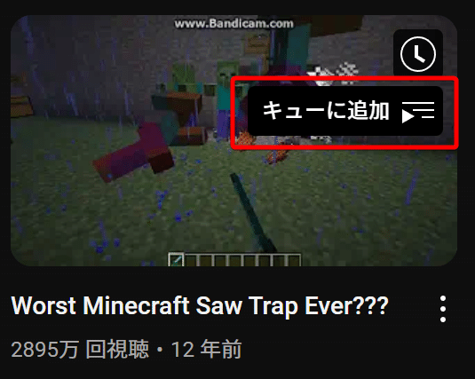

## とりあえず利用したい方へ

ChromeとFirefoxの拡張機能を公開しているのでこちらからインストール。

Chrome Web Store: [https://chromewebstore.google.com/detail/youtube-play-all/lcgfhpllcjejniehjnhbfhnkdpmkeoce](https://chromewebstore.google.com/detail/youtube-play-all/lcgfhpllcjejniehjnhbfhnkdpmkeoce)
Firefox Add-ons: [https://addons.mozilla.org/firefox/addon/youtube-play-all/](https://addons.mozilla.org/firefox/addon/youtube-play-all/)

ソースコードもすべて公開している
github: [https://github.com/CatBraaain/browser-youtube-play-all](https://github.com/CatBraaain/browser-youtube-play-all)

## この記事の目的

拡張機能開発およびYoutubeサイトスクレイピングにおける技術メモを残すため。

## 作成の経緯

音楽系のYoutubeチャンネルにおいて、人気順ですべての動画を再生したいという状況があった。
デフォルト機能を用いる場合は、動画を１つずつ順番に`キューに追加`をクリックしていく必要があるが、その労力を削減するため拡張機能を作成した。



## フレームワーク

今までの拡張機能の開発では、以下の不満があった。

- 開発中のリロードやデバッグが面倒
- ファイルモジュール化してimport/exportが使いにくい（バンドラーの使用を推奨）
- クロスブラウザ化が面倒

### フレームワークの比較検討

下記の5つを比較した

- [crxjs](https://github.com/crxjs/chrome-extension-tools)
  メンテナンスされてない、プロジェクトの終了も近い\*[1](https://github.com/crxjs/chrome-extension-tools/discussions/974)
- [vite-plugin-web-extension](https://github.com/aklinker1/vite-plugin-web-extension)
  後継であるwxtを推奨
- [extension.js](https://github.com/extension-js/extension.js)
  github star は多いけど、ユーザーの技術記事などがあまり見つからず
- [plasmo](https://github.com/PlasmoHQ/plasmo)
  一番人気だが、しばらくメンテナンスされてない\*[2](https://github.com/wxt-dev/wxt/pull/1404)
- [wxt](https://github.com/wxt-dev/wxt)
  人気の新人、内部でviteを利用しており、3rd-party viteプラグインも利用できる

wxtの一強のように見えた。wxtを採用。
Viteプラグインを挿入できるので、気に入らない点があれば自分で書き換えることも可能。というところも安心点だ。

参考: [https://wxt.dev/guide/resources/compare](https://wxt.dev/guide/resources/compare)

## wxt

### wxtでできること

- 開発中のホットリロード（手動の場合は、chrome://extensions/ の更新ボタンを押下してから対象ページリロード）
- TypeScriptのサポート
- クロスブラウザ対応 (Chrome,Firefox,Safari,Edge,Opera)\*[3](https://wxt.dev/guide/essentials/config/environment-variables.html#built-in-environment-variables)
- manifest.jsonの自動生成
- Viteプラグインの挿入

### wxtのインストール

公式のインストール手順: [https://wxt.dev/guide/installation#installation](https://wxt.dev/guide/installation#installation)
テンプレートもあるが、私は時間より学習が優先だったので手動で行った

### wxtの設定

私は下記の通り設定した。

```ts
// wxt.config.ts
import { defineConfig } from "wxt";

export default defineConfig({
  srcDir: "src", // デフォルトだとプログラムファイルもroot直下にフラット配置される
  outDir: "dist", // デフォルトだと`.output`に出力される
  imports: false, // import/exportを省略できる設定を無効化
  extensionApi: "chrome", // 理由は忘れたが、クロスブラウザプロジェクトでもchromeを指定が無難だという結論に至った
  manifest: ({ browser }) => ({
    name: "Youtube Play All", // 拡張機能名 package.jsonと一致する場合はここは省略できる
  }),
  zip: {
    artifactTemplate: "{{browser}}.zip", // ビルド後のzipファイル名 (default:"{{name}}-{{version}}-{{browser}}.zip")
    sourcesTemplate: "sources.zip", // ビルド後のzipファイル名 (default:"{{name}}-{{version}}-sources.zip")
  },
});
```

### package.json scripts

解説のためにコメントをつけているが、package.jsonでコメントは使えないので注意。

```json
// package.json

  "scripts": {
    "typecheck": "tsc --noEmit",

    // concは、[concurrently]のエイリアスで並列実行するツール。
    "build": "conc npm:typecheck npm:build:*",
    "build:chrome": "wxt build -b chrome",
    "build:firefox": "wxt build -b firefox",

    // restart-tries 1は、エラーが発生した場合に再試行する回数を指定するオプション。
    // タイミングによってchrome,firefoxの開発サーバーのポートが重複することがあるため。
    "dev": "conc npm:typecheck npm:dev:* --restart-tries 1",
    "dev:chrome": "wxt -b chrome",
    "dev:firefox": "wxt -b firefox",

    // prepareは、wxtの初期設定を行う。これをしないとずっと型エラーが出る。
    // postinstallは、npm install後に自動実行される。
    "postinstall": "wxt prepare",

    // wxt submit は、[publish-browser-extension]のエイリアス。(なお作者は同じ)
    // 事前に.env.submitファイルを作成する必要がある。
    "publish": "npm run zip && wxt submit",

    // zipファイルの名前を固定して`.env.submit`にファイル名をハードコードすることで
    // `wxt submit`の際に毎度ファイル名を指定しなくてよくなる。
    "zip": "conc npm:zip:*",
    "zip:chrome": "wxt zip -b chrome",
    "zip:firefox": "wxt zip -b firefox"
  },

// [concurrently]: https://github.com/open-cli-tools/concurrently
// [publish-browser-extension]: https://www.npmjs.com/package/publish-browser-extension
```

### 使ってみて気づいた利点

通常だったらmanifest.jsonにcontent-scriptのパスを書く必要があったが
wxtでは、content-scriptファイル内で定義が完結するため、content-scriptのパスの記入は不要。
content-scriptファイルをリネームしてmanifest.jsonを書き直すの忘れてエラーが起きて、みたいなことがなくなる。
さらに、manifest.jsonに追加される設定を動的に生成できるので変数なども使える。

```ts
// content-script.ts
const youtubeUrlPattern = "https://www.youtube.com/*";
export default defineContentScript({
  matches: [youtubeUrlPattern], // 変数が使える!
  runAt: "document_end",
  main,
});

function main() {
  console.log("content script loaded");
}
```

フレームワークってすごいなと思った。

## Youtubeサイトにおける技術メモ

### プレイリスト

プレイリストは、プログラムで１つずつ動画を追加しなくても自動生成できるURLルールがある

### 最新順、人気順のプレイリストのURL

`https://www.youtube.com/playlist?list=\${playlistPrefix}\${channelId}\&playnext=1` で再生リストを再生できる。

例：[https://www.youtube.com/playlist?list=UULFX6OQ3DkcsbYNE6H8uQQuVA&playnext=1](https://www.youtube.com/playlist?list=UULFX6OQ3DkcsbYNE6H8uQQuVA&playnext=1)

チャンネルIDの取得方法は後述

playlistPrefix 一覧

- UULF: Videos
- UULP: Popular videos
- UULV: Live streams
- UUMF: Members-only videos
- UUMO: Members-only contents (videos, short videos, and live streams)
- UUMS: Members-only short videos
- UUMV: Members-only live streams
- UUPS: Popular short videos
- UUPV: Popular live streams
- UUSH: Short videos

参考: [https://stackoverflow.com/questions/71192605/how-do-i-get-youtube-shorts-from-youtube-api-data-v3](https://stackoverflow.com/questions/71192605/how-do-i-get-youtube-shorts-from-youtube-api-data-v3)

### 古い順のプレイリストのURL

`[https://www.youtube.com/watch?v=${oldestVideoId}&list=UL01234567890`](https://www.youtube.com/watch?v=$%7BoldestVideoId%7D&list=UL01234567890%60) で古い順の再生リストを再生できる。

例：[https://www.youtube.com/watch?v=2XVcLrB7B3Y&list=UL01234567890](https://www.youtube.com/watch?v=2XVcLrB7B3Y&list=UL01234567890)

最後のULの後のマジック文字列は、11文字の英数ならなんでもよい。
ハイフンやアンダーが混ざってもよい場合があるが、条件が細かくて解明できず

ショートの場合
`[https://www.youtube.com/shorts/${oldestVideoId}&list=UL01234567890`](https://www.youtube.com/shorts/$%7BoldestVideoId%7D%26list=UL01234567890%60) ではうまくいかないので
‘watch?v=‘の形のURLに変換すること

参考: [https://www.reddit.com/r/LifeProTips/comments/247c2u/comment/izd3ttq/](https://www.reddit.com/r/LifeProTips/comments/247c2u/comment/izd3ttq/)
参考: [https://note.com/ueda_ganmo/n/n67800d93cf61](https://note.com/ueda_ganmo/n/n67800d93cf61)

### チャンネルIDの取得

`$("link[rel='canonical']")`のセレクターで取得できるという情報を見かけるが、特定条件下では取得できない。
`ytInitialData`というグローバル変数による取得方法も同様である。

検索画面や動画画面から動画チャンネルページにアクセスすると、ページが動的に更新されるため、動画チャンネルページの初期リクエストが行われない。そのため、HTML内に安定したチャンネルIDが表示されず、canonical リンクが取得できないことがある。

この問題を回避するには、次の方法が考えられる。

- バックグラウンドでのフェッチ
  バックグラウンドで再度リクエストを送る方法。これにより、canonical リンクを取得することができる。
- `yt-navigate-finish` イベントを利用
  YouTubeウェブサイトのカスタムイベントである `yt-navigate-finish`
  このイベントの引数からチャンネルIDなどの情報を取得することができる。

## SideNote: Youtubeがこの機能を渋っている理由

多くのユーザーがこの機能の必要性を感じている中で、なぜYouTubeの運営はこの機能を実装しないのか、という疑問が浮かぶ。
ユーザー体験の向上にはこの機能が不可欠だとYouTube運営も理解しているはずだが、それでも実装しない理由は、単なる怠慢やユーザーへの嫌がらせではない。
実際には、YouTube運営にはこの機能を提供しないことで得られる技術的なメリットが存在する。

YouTubeがこの機能を提供しない背後には、サーバー負荷の軽減という要因がある。
すべて再生ボタン（特に古い順）を提供すると、サーバーへのリクエストが多様化し、キャッシュの効率が悪化する可能性がある。
これにより、サーバーは不必要なリソースを消費し、パフォーマンスに悪影響を与える。

一方、特定の人気動画にアクセスが集中することで、YouTubeはキャッシュヒット率の向上を実現できる。
キャッシュされたコンテンツを効率よく配信することで、サーバー負荷を軽減し、動画配信の効率を高めることができる。
これにより、全体的なシステムの安定性とスケーラビリティが向上するため、YouTube運営にとっては技術的に優れた戦略となる。

このような背景から、YouTubeはユーザー体験を犠牲にすることで、システム全体の最適化を優先していると言える。

## 所感

wxtは、かなり気に入った。
現時点でも十分な開発体験を得られたが、まだまだ発展予定のようなので今後が楽しみだ。
