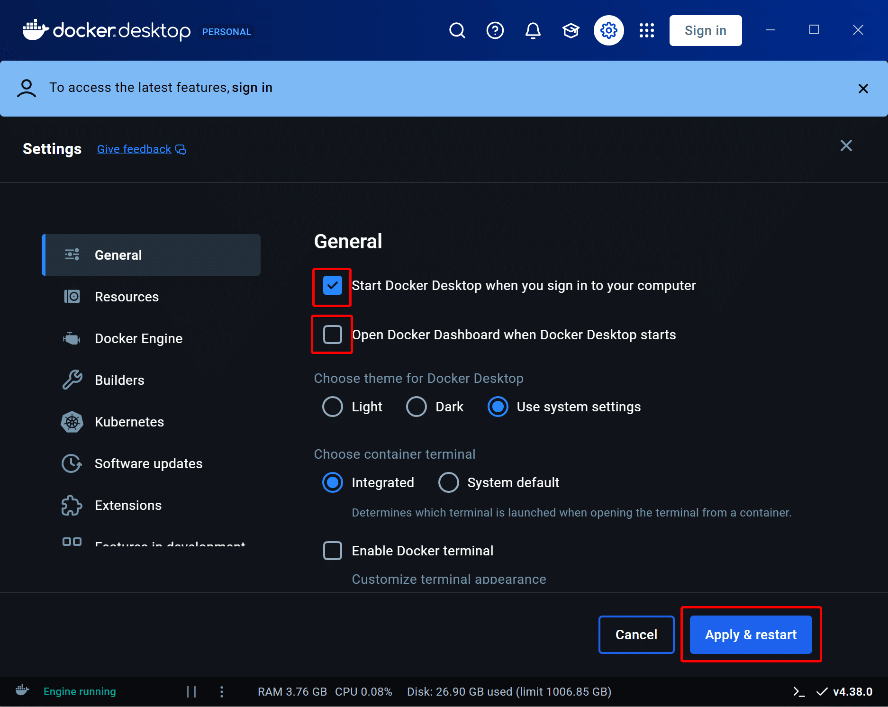

設定の変更のみでできた

### Start Docker Desktop when you sign in to your computer

パソコン立ち上げたときに自動起動するオプションを有効化

### Open Docker Dashboard when Docker Desktop starts

起動時にGUI画面を開くオプションを無効化（タスクトレイにのみ残る）

### Apply & restart

設定を適用

以上
