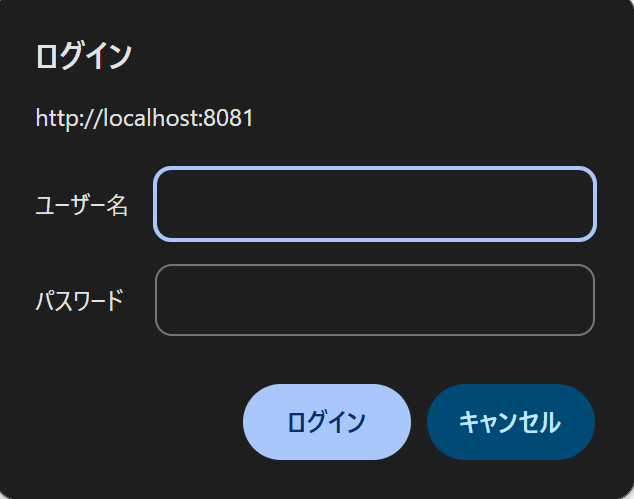
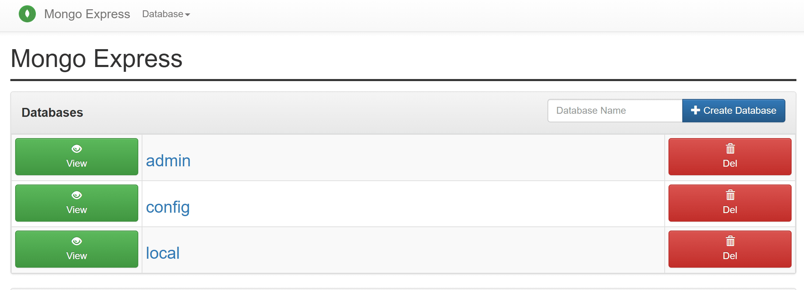

## 認証なしなのにログイン必須！？

認証なしのmongodbにアクセスしたいのにログイン画面が出てきた

## デフォルトは、admin:pass らしい

> basicAuth のデフォルトの資格情報は admin:pass ですが、`config.default.js`を`config.js`にコピーして関連する行を調整することで、これらを変更することを強くお勧めします。

[https://github.com/mongo-express/mongo-express/issues/149](https://github.com/mongo-express/mongo-express/issues/149)

## ログインしてみる

入力したら

ログインできた
