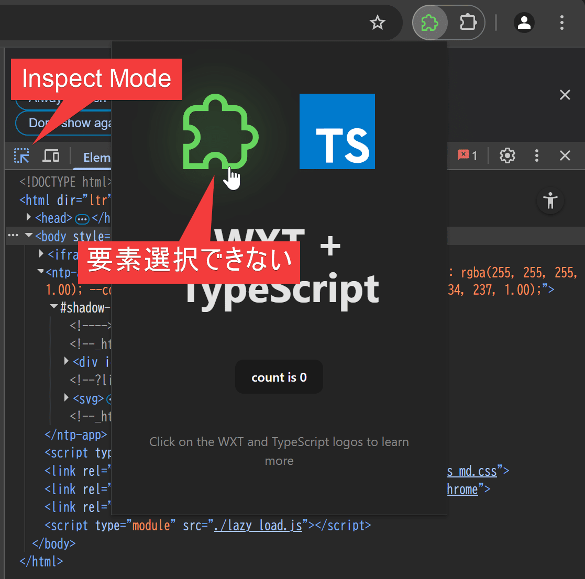
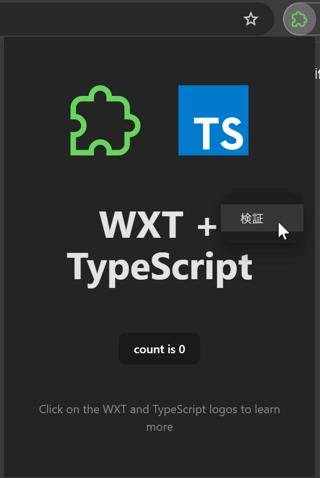

## 目的

Chrome拡張機能のpopup.htmlのデバッグをしたい
html内の要素をDevToolsで確認したい

## 状況

下図の拡張機能のpopupでパズルマークの画像のURLを確認したい
DevToolsでInspectModeにしてるのに、popup.htmlで要素選択ができない

## やり方１

popupを開いて、popupページエリア内で右クリック→検証

すると別ウィンドウでDevToolsが開く

## やり方２

chrome://extensions/ にアクセス

対象の拡張機能の詳細ボタンをクリック

URLからExtensionIDを取得

chrome-extension://${ExtensionID}/popup.html にアクセス

すると、メインエリア？にpopup.htmlが展開される

## 参考

[https://qiita.com/nosniklim/items/c7d074f13e81d4aca851](https://qiita.com/nosniklim/items/c7d074f13e81d4aca851)

[https://stackoverflow.com/questions/29178827/debugging-chrome-extension-default-popup-using-dev-tools](https://stackoverflow.com/questions/29178827/debugging-chrome-extension-default-popup-using-dev-tools)
