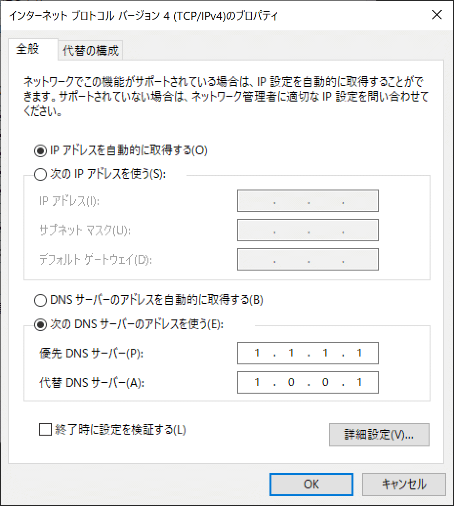

## 状況

OS: Windows
VPNの利用なし

supabase self-hosted の立ち上げで docker compose pull をしたら下記のエラーが発生した

```console
failed to copy: httpReadSeeker: failed open: failed to do request: Get "https://production.cloudflare.docker.com/registry-v2/docker/registry/v2/blobs/sha256/53/531e3bd93090d08ef911bb2c8320f2fef2428ef96597535a55111fda18efde52/data?expires=1748500111&signature=9q%2BD5EQNgh0iHMu3KFT%2Bjtawq74%3D&version=2": net/http: TLS handshake timeout
```

## 解決方法

OSのDNS設定でCloudFlare(1.1.1.1, 1.0.0.1)を利用する



> `1.1.1.1` および `1.0.0.1` は、Cloudflare が提供する無料のパブリックDNSサーバーのアドレスです。
> Cloudflare は高速かつプライバシー保護に優れたインターネットサービスを展開する企業で、このDNSサービスもその一環として公開されています。
>
> これらのDNSサーバーは、Googleの `8.8.8.8` などと同様に、誰でも無料で利用することができ、
> 特に広告ブロックや通信の検閲回避の一助としても活用されています。
>
> CloudflareのDNSは、速度・信頼性・プライバシーのいずれをとっても高水準であり、非常に優れた無料サービスです。

ChatGPTより

## 所感

パブリックDNSというものを初めて知った
無料でデータ収集されないでしかも速いんなら設定しない理由はないよね
と思ったけど実際に測定してみたら大差なかった
よくわかんないけど、エラーは解決したのでcloudflareのままで様子見

## 参考

[https://github.com/docker/for-mac/issues/7306#issuecomment-2869653442](https://github.com/docker/for-mac/issues/7306#issuecomment-2869653442)

[https://faq.interlink.or.jp/faq2/View/wcDisplayContent.aspx?sso_step=1&id=639](https://faq.interlink.or.jp/faq2/View/wcDisplayContent.aspx?sso_step=1&id=639)
